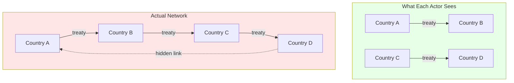
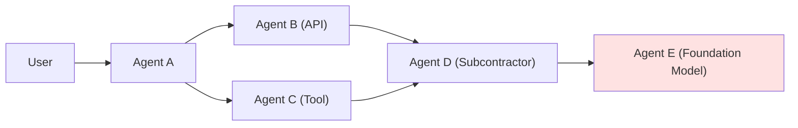

:::note[TL;DR]
When actors form bilateral alliances without mapping the full network, local commitments can produce global catastrophe. WW1 is the canonical example: each country understood its own treaties, but nobody modeled the system. A regional assassination triggered a world war because the sum of bilateral relationships ≠ system behavior.
:::

---

## The Pattern

**Alliance cascade failure** occurs when:
1. Multiple actors form bilateral relationships (treaties, contracts, dependencies).
2. Each actor reasons about its own relationships, not the network.
3. A trigger activates one relationship, which activates others through hidden connections.
4. The cascade propagates faster than decision-making can respond.

The danger is not that the couplings appear under stress (as in the [2008 correlation spike](/research/trust-behavior/correlated-failure-modeling/#correlation-under-stress)) but that they were *always present and invisible* to the actors.

---

## World War I, Condensed

By 1914 Europe's powers had a dense web of alliances—the Triple Entente (France–Russia, France–Britain, Anglo-Russian) against the Triple Alliance (Germany–Austria-Hungary, plus Italy), all tangled around Serbia and the Balkans. Each foreign ministry modeled only its own bilateral edges: "We have a treaty with X; X backs us if Y attacks; this deters Y." Nobody computed what happened system-wide if one edge activated.

Three kinds of **hidden coupling** bound the network far tighter than the formal treaties implied:

- **Mobilization schedules.** The Schlieffen Plan required Germany to attack France *before* Russia could fully mobilize. So: Russia mobilizes → Germany must mobilize → Germany attacks through Belgium (the only plan it had) → Britain enters (Belgian neutrality). The *speed* of the cascade was hardcoded into war plans.
- **Secret clauses and implicit commitments.** Unpublished treaty provisions, British–French staff talks, and naval agreements meant no power fully knew what the others had promised.
- **Irreversibility.** Once mobilization began, stopping it was nearly impossible—there was no decision point left to pull.

The cascade ran in **five weeks**: assassination (June 28) → Austrian ultimatum → Austria declares war on Serbia (July 28) → Russia mobilizes → Germany declares war on Russia (Aug 1) and France (Aug 3) → invades Belgium → Britain declares war (Aug 4).

**The entanglement tax.** Bilateral reasoning put the chance of a Balkan incident becoming a world war at perhaps 5%. The network reality, given the alliance structure and the mobilization clocks, was closer to certainty—roughly a **20× underestimate** of systemic risk, paid in millions of lives. Everyone was partially right about their local view and catastrophically wrong about the system.

---

## Lessons for AI Delegation

An alliance is a form of delegation: "when X happens, I commit to Y," which entangles your response with your ally's. The same failure appears when an agent delegates to another agent that delegates onward—your Delegation Risk depends on couplings several hops out that you never mapped.

Modern analogues share the structure: 2008 financial contagion, supply chains coupled through shared Tier-2/3 suppliers (the 2021 chip shortage), and **AI agent networks** where each agent knows only its immediate dependencies while a compromise in a shared foundation model can propagate through the whole graph in minutes rather than days.

Design implications:
- **Map the network, not your edges.** Ask what happens two or three hops out; build the full dependency graph and test failure correlation ("if Provider A fails, who else fails?").
- **Watch the mobilization schedule.** The most dangerous cascades have automatic triggers, speed asymmetry (cascade faster than deliberation), and irreversibility.
- **Build circuit breakers.** Never deploy a system whose cascade speed exceeds human decision-making without explicit interrupts: fallback models, conditional rather than automatic commitments, and mandatory deliberation points.
- **Reserve larger margins for unmapped dependencies.** Standard [risk budgeting](/cross-domain-methods/euler-allocation/) assumes you know the covariance structure; alliance cascades violate exactly that assumption.

---

## Key Takeaways

:::note[Key Takeaways]
1. **Bilateral thinking is dangerous.** A local view of your relationships doesn't reveal system behavior.
2. **Hidden couplings create hidden risk.** Secret clauses, implicit commitments, and shared dependencies bind the network tighter than formal agreements suggest.
3. **Cascade speed matters.** When propagation outruns decision-making, human intervention becomes impossible.
4. **The entanglement tax can be catastrophic.** WW1's ~20× underestimate of systemic risk cost millions of lives.
5. **Map the network and build circuit breakers**—especially in AI agent graphs, where cascades run in minutes.
:::

---

## See Also

- [Correlated Failure Modeling](/research/trust-behavior/correlated-failure-modeling/) — The 2008 parallel and formal models
- [Channel Integrity Patterns](/design-patterns/channel-integrity/) — Preventing unauthorized coordination
- [Hidden Coordination](/entanglements/cross-domain/hidden-coordination/) — Adversarial use of hidden networks
- [Exposure Cascade](/delegation-risk/exposure-cascade/) — How risk flows through hierarchies

## Further Reading

- Clark, Christopher. *The Sleepwalkers: How Europe Went to War in 1914* (2012)
- Tuchman, Barbara. *The Guns of August* (1962)
- Haldane, Andrew. "Rethinking the Financial Network" (2009) — 2008 as network failure
- Taleb, Nassim. *The Black Swan* (2007) — Hidden dependencies and fat tails
