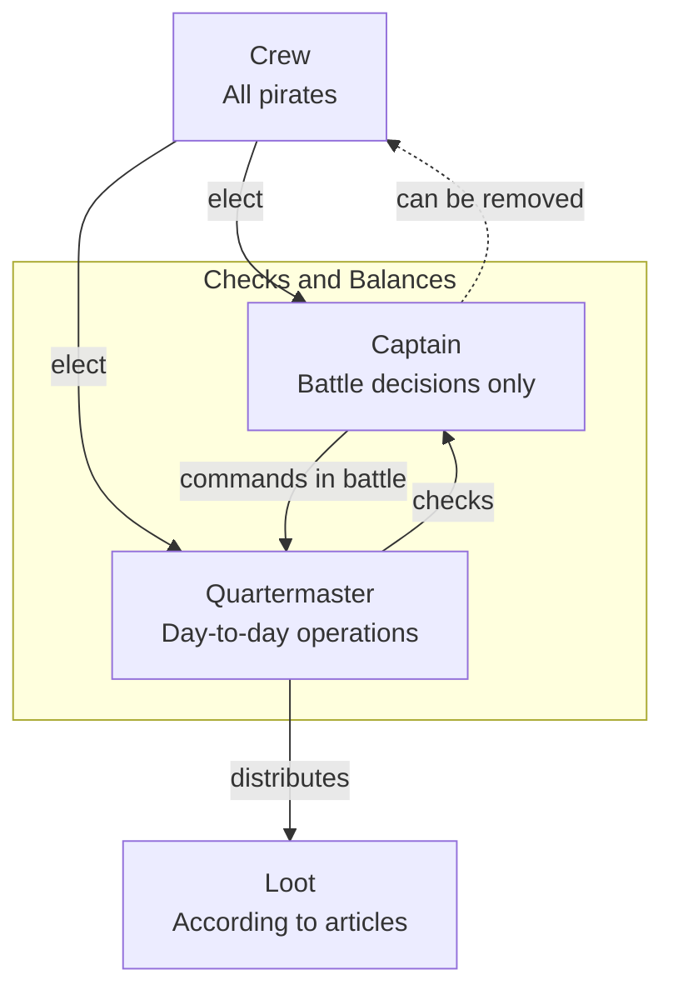
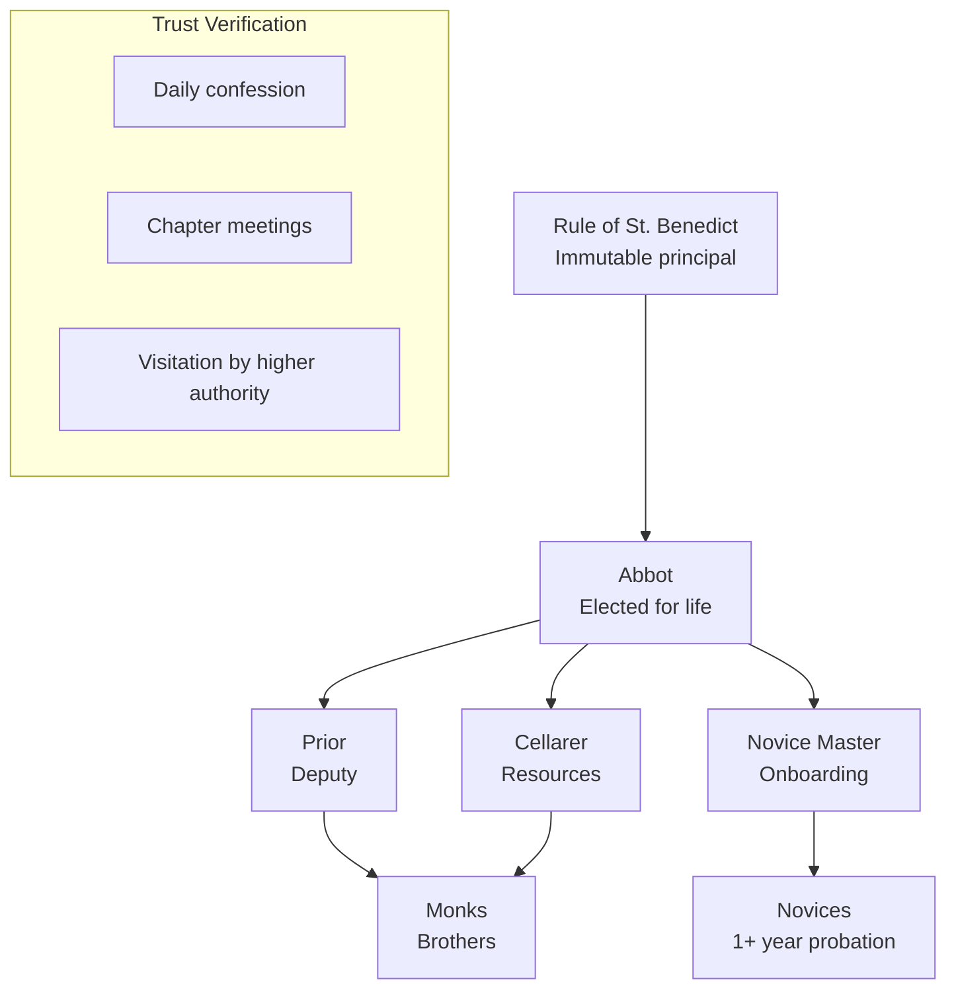
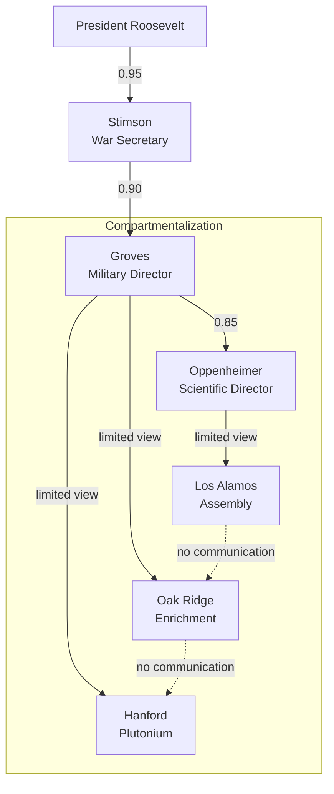

# Trust Across Civilizations

:::note[Framework Interpretation]
This case study analyzes historical organizational forms through the lens of our delegation risk framework. The historical examples are drawn from organizational history, but the specific framing as "trust architectures" is our own interpretation.
:::

Long before AI agents, humans built technologies for scaling trust. Every organizational form—from pirate ships to monasteries to wartime weapons programs—is a solution to the same problem: how do you get things done when you can't do everything yourself and can't fully trust anyone else?

Read as **trust architectures**, organizations reveal a hidden design language. An org chart is a risk budget. A management layer is a risk-inheritance function. Below are three forms that solved the delegation problem in radically different—and unexpectedly sophisticated—ways. (For the canonical treatment of how these architectures *fail*—Enron, Boeing, credit-rating agencies—see [Historical Case Studies](/entanglements/case-studies/historical-cases/).)

---

## The Pirate Ship: Democratic Trust

18th-century pirate ships had remarkably sophisticated trust architecture:

**Trust innovations:**
- **Elected leadership**: The captain could be voted out at any time, keeping authority accountable.
- **Separation of powers**: Captain for combat, Quartermaster for everything else—no single point of unchecked control.
- **Written contracts**: "Articles of Agreement" specified exact delegation bounds—loot distribution, injury compensation, punishment for violations.
- **Radical transparency**: All loot displayed publicly before division.

**Delegation Risk of a pirate captain** (illustrative figures):

| Authority | P(abuse) | Damage | Delegation Risk |
|-----------|----------|--------|-----|
| Battle command | 0.05 | 50 lives × \$50K = \$2.5M | \$125,000 |
| Loot distribution | 0.01 (public, audited) | \$100K | \$1,000 |
| Discipline | 0.03 | \$20K (crew morale) | \$600 |
| Route decisions | 0.10 | \$500K (bad hunt) | \$50,000 |
| **Total** | | | **~\$176,600/voyage** |

Compare to a Royal Navy captain of the same era: roughly **\$2M** Delegation Risk—absolute authority, no accountability, press-ganged crews with no exit option.

:::note[The Democracy Discount]
Pirate ships achieved roughly **10× lower Delegation Risk** than naval vessels through democratic accountability. The "lawless" pirates had better trust architecture than the "civilized" navy—because their checks were structural, not aspirational.
:::

---

## The Monastery: Eternal Trust Through Verification Frequency

Benedictine monasteries have operated continuously for 1,500 years. Their trust architecture:

**Trust innovations:**
- **Slow trust**: 1+ year novitiate before any commitment; vows only after years.
- **Ritual verification**: Daily confession and weekly chapter meetings—continuous trust recalibration.
- **Poverty as a trust mechanism**: Monks own nothing, so there is no economic motive for violation.
- **Lifetime stakes**: Leaving carries severe social and spiritual cost.
- **External audit**: Periodic visitation by a bishop or order superior.

**Why monasteries survive** (illustrative decay rates):

| Organization Type | Median Lifespan | Trust Decay Rate |
|-------------------|-----------------|------------------|
| Startup | 3 years | λ = 0.8/year |
| Corporation | 15 years | λ = 0.15/year |
| University | 200 years | λ = 0.01/year |
| Monastery | 500+ years | λ = 0.002/year |

The secret is the combination of **extreme verification frequency** (daily) and **extreme stakes** (eternal salvation). Most organizations verify trust quarterly at best; monasteries verify it every 24 hours. The general lesson: trust-decay rate is governed far more by *how often you check* than by *how carefully you select*.

---

## The Manhattan Project: Compartmentalized Trust for Catastrophic Stakes

100,000+ people kept the atomic bomb secret. How?

**Key insight**: Workers at Oak Ridge didn't know they were enriching uranium. Workers at Hanford didn't know they were making plutonium. Only a dozen-odd people understood the full picture.

**Trust topology properties:**
- **Need-to-know**: Each component had the minimum context required for its task.
- **Physical isolation**: Sites geographically separated.
- **Internal security**: 500+ security officers, mail censorship, travel restrictions.
- **Misdirection**: Cover stories ("agricultural research") reduced even the motivation to inquire.

**Delegation Risk of the project** (illustrative):

| Failure Mode | P(occurrence) | Damage | Delegation Risk |
|--------------|---------------|--------|-----|
| Leak to Germany | 0.001 | Nuclear arms race during WWII, \$100B+ | \$100M |
| Leak to USSR | 0.01 | Earlier Soviet bomb (happened: Fuchs) | \$500M |
| Technical failure | 0.20 | \$2B wasted, war prolonged | \$400M |
| Workplace accident | 0.30 | \$10M (radiation, criticality) | \$3M |

**Actual outcome**: The USSR got the bomb 2–4 years earlier because Klaus Fuchs, a British physicist in the theoretical division, passed secrets. Compartmentalization failed precisely at the node with atypically *high* context—Fuchs understood the full design.

:::caution[The Fuchs Failure]
A classic "trusted lieutenant" failure: background checks (the British had cleared him) substituted for ongoing verification. Fuchs's Delegation Risk was enormous but was treated as minimal because "our ally vouched for him." Compartmentalization protects you from low-context nodes; it does nothing for a high-context node you've already decided to trust.
:::

---

## What the Three Forms Teach

Each architecture optimizes a different lever of the delegation problem:

| Form | Primary lever | Lesson for AI delegation |
|------|---------------|--------------------------|
| Pirate ship | **Structural accountability** (elected, revocable, separated powers) | Make authority cheap to revoke and split it across roles that check each other. |
| Monastery | **Verification frequency** | Continuous checking beats careful one-time selection; decay rate falls with how often you verify. |
| Manhattan Project | **Compartmentalization** | Limiting context bounds the blast radius of any single defection—but offers no protection at high-context nodes. |

The deepest shared lesson is that **none of these systems relied on trusting people to be good.** They relied on architecture: revocability, frequent verification, and bounded context. The same three levers map directly onto AI agent design—least-capability and revocable authority (pirate), continuous monitoring (monastery), and context isolation between agents (Manhattan).

For how these same levers *fail* in modern institutions—auditor capture (Enron/Andersen), self-certification (Boeing/FAA), correlated verifiers (credit-rating agencies)—see [Historical Case Studies](/entanglements/case-studies/historical-cases/), which is the canonical treatment. The corruption-cascade dynamics of loyalty-based hierarchies (e.g. Nixon's White House) and verification-free boards (Theranos) are instances of the same pattern: trust granted without an architecture to revoke or check it.

---

## Key Takeaways

:::tip[Key Takeaways]
1. **Organizations are trust architectures**: every org chart is really a trust topology and a risk budget.
2. **The best historical solutions never trusted people to be good**—they made authority revocable (pirates), verified continuously (monasteries), or bounded context (Manhattan Project).
3. **Verification frequency dominates selection quality**: monasteries outlive corporations because they check daily.
4. **Compartmentalization bounds blast radius but not high-context betrayal**: the Fuchs failure shows where need-to-know stops protecting you.
5. **These levers transfer to AI**: revocable least-capability authority, continuous monitoring, and inter-agent context isolation are the same three moves.
:::

---

## See Also

- [Historical Case Studies](/entanglements/case-studies/historical-cases/) — Canonical treatment of modern trust-architecture failures (Enron, Boeing, rating agencies)
- [Organizational Trust (Practical)](/case-studies/human-systems/organizational-trust/) — Small business and political examples with ROI calculations
- [Delegation Risk Overview](/delegation-risk/overview/) — The mathematical foundations
- [Risk Inheritance](/research/theory/trust-propagation/) — Algorithms for trust networks
- [Case Study: Sydney](/case-studies/ai-systems/case-study-sydney/) — Trust failure in AI (contrast with organizational failures)
