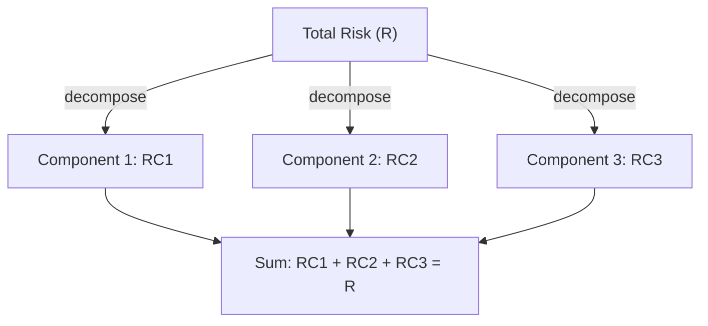
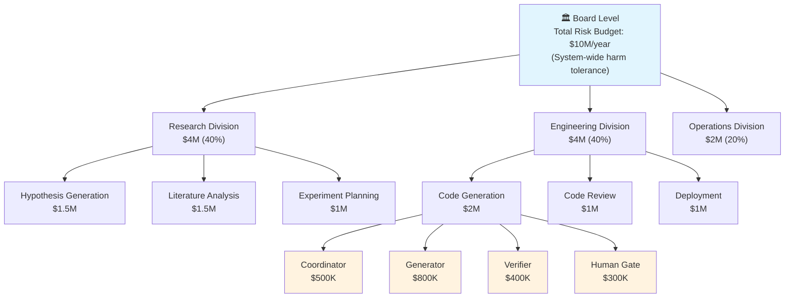

# Euler Allocation: The Fundamental Aggregation Problem

:::note[Transferability]
Euler allocation works well for portfolio risk where components are well-characterized and the risk function is smooth. AI systems may not satisfy these assumptions. Financial risk management also had notable failures (2008), so even within its original domain, this approach has limitations.
:::

Each component's risk contribution is: **RC_i = x_i × (∂R/∂x_i)** — weight times marginal impact.

The mathematical foundation for hierarchical risk decomposition comes from financial risk budgeting, where **Euler's theorem for homogeneous functions** enables perfect additive decomposition of total risk into component contributions. For any risk measure R(x) that is homogeneous of degree 1 in portfolio weights, total risk equals the sum of each component's marginal contribution multiplied by its weight: **R(x) = Σᵢ xᵢ · ∂R(x)/∂xᵢ**.

:::tip[Why This Matters]
This Euler decomposition guarantees that allocated risks "add up" exactly to total risk—a property called full allocation that no ad-hoc method achieves.
:::

## Practical Implementation

The practical implementation uses Component VaR (CoVaR) for Value at Risk or Expected Shortfall contributions. Component VaR for position i equals **CoVaR_i = x_i · β_i · VaR**, where β_i is the position's beta to the portfolio. The crucial property: **Σᵢ CoVaR_i = Total VaR** exactly, accounting for diversification benefits. Banks cascade these budgets from board-level risk appetite through business units to trading desks, with each level receiving explicit risk limits derived from the aggregate. The Financial Stability Board's 2013 Risk Appetite Framework established this as regulatory standard, requiring quantitative risk tolerances that flow hierarchically through organizations.

### Budget Cascade Example

Here's how a $10M annual risk budget might flow through an AI research organization:

**Key properties of this cascade**:
- **Full allocation**: $500K + $800K + $400K + $300K = $2M (Code Generation budget)
- **Marginal contribution**: Generator gets more budget because it has higher impact potential
- **Diversification**: Independent components can use their full budgets simultaneously
- **Accountability**: Each level is responsible for staying within its allocation

## Application to AI Safety

This approach directly transfers to AI safety: if system-level harm probability is the risk measure, and subsystem contributions can be computed via marginal impacts, Euler allocation provides mathematically principled decomposition. The challenge lies in defining appropriate homogeneous risk measures for AI systems—current approaches like Anthropic's AI Safety Levels provide tiers but lack the continuous differentiability Euler allocation requires.

## Key Properties

- **Full allocation**: Component risks sum exactly to total
- **Marginal contribution**: Each component's share reflects its impact on total risk
- **Diversification accounting**: Correlations between components are handled correctly
- **Hierarchical cascading**: Budgets flow from top-level to components

:::caution[Limitations for AI]
Requires continuous, differentiable risk measures. Assumes risks can be meaningfully quantified. Historical data may not predict future AI behavior. Independence assumptions may fail for correlated AI failures.
:::

## When Euler Allocation Applies — and When It Doesn't

Euler's theorem requires the risk measure to be **homogeneous of degree 1**: scale every exposure by λ and total risk scales by exactly λ ($R(\lambda x) = \lambda R(x)$). Whether Delegation Risk satisfies this is not automatic — it depends on the harm structure, and this framework has not always been explicit about that. The honest scoping:

**Where homogeneity plausibly holds (use Euler):**
- *Smooth, marginal regimes.* Expected-cost risk (Σ P(harm) × Damage) is linear in exposure scale when doubling a component's task volume roughly doubles both its opportunities to fail and its damage exposure. Most operational, high-frequency/low-severity risk (bad summaries, misrouted tickets, wasted compute) behaves this way.
- *Portfolio-like aggregation*, where many components contribute small, roughly continuous increments to total risk.

**Where homogeneity fails (don't use Euler):**
- *Threshold effects.* If damage jumps discontinuously at a capability or access boundary — a component that is harmless below some permission level and catastrophic above it — then $R(\lambda x) \neq \lambda R(x)$ near the threshold, the gradient is undefined or misleading, and marginal allocation assigns nonsense budgets.
- *Superadditive interactions.* When joint deployment creates risk that no component carries alone (collusion, [entanglement](/entanglements/), emergent capability from composition), total risk exceeds the sum of scaled standalone risks. Euler will systematically under-allocate to the components driving the interaction.
- *Fixed-cost harms.* A harm that occurs at full magnitude from the first unit of exposure (a single leaked credential) is not scaled by exposure at all.

**The decision rule:**

| Regime | Method | Cost |
|---|---|---|
| Smooth, marginal, near-linear | **Euler allocation** | O(n) gradient evaluations |
| Discrete contributions, threshold effects, strong interactions | **Shapley values** — exact fair attribution with no homogeneity assumption | O(2ⁿ) coalitions (sampling approximations exist) |
| Dominated by a few identifiable catastrophic scenarios | **Explicit scenario analysis** — enumerate, bound, and gate the scenarios directly | Analyst time |

In practice: use Euler for the routine risk budget, then check it by asking "does any component sit near a threshold, and does any pair create joint risk neither has alone?" If yes, price those specific structures with Shapley or scenario gates on top of the Euler base. See [Financial Risk Budgeting](/research/risk-methods/financial-risk-budgeting/) for the Euler/Shapley comparison in depth and [Risk Measurement & Pricing](/research/risk-methods/risk-measurement-and-pricing/) for coherent-measure foundations.

## Key Takeaways

1. **Budgets can sum exactly** — Euler's theorem guarantees full allocation when risk measures are homogeneous
2. **Marginal impact matters** — Each component's share reflects its actual contribution to total risk
3. **Diversification is captured** — Correlations between components are handled mathematically
4. **Hierarchy works** — Budgets cascade cleanly from board level to individual components

## Next Steps

- **See the formula in action** → [Framework Overview](/delegation-risk/overview/) applies this to AI systems
- **Cascade through organizations** → [Exposure Cascade](/delegation-risk/exposure-cascade/) shows hierarchical flow
- **Interactive calculation** → [Delegation Risk Calculator](/design-patterns/tools/delegation-risk-calculator/)
- **Related method** → [ASIL Decomposition](/cross-domain-methods/asil-decomposition/) from automotive
