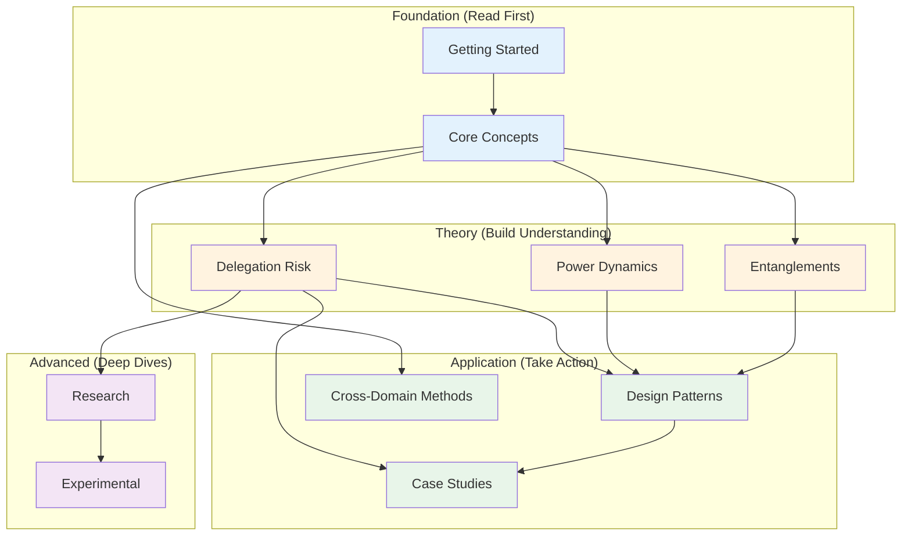
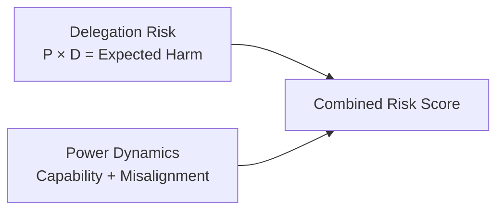
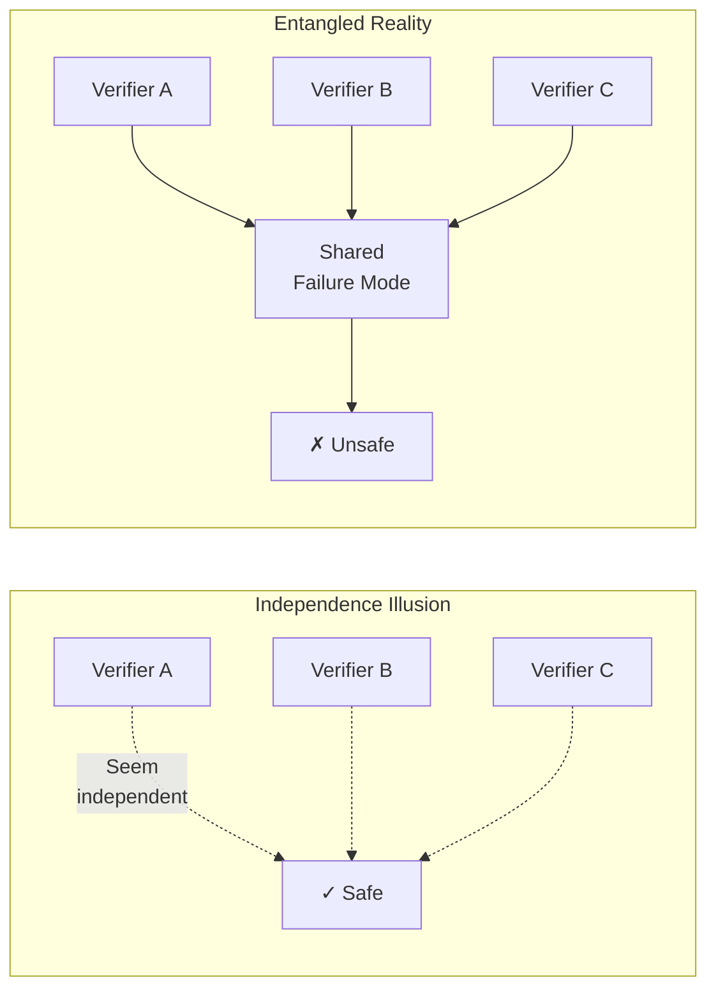

# The Core Path & Reading Order

This site is large (~160 pages), but its essential argument lives in about a dozen stops. **If you read only one path, read this one** — it covers the framework's most distinctive material in order, in roughly 4–6 hours. Pages on this path are marked with a Core badge in the sidebar. Everything else on the site is reference depth, supporting research, or applied variation.

## The Core Path

**Before you start:** skim the [Five-Minute Intro](/getting-started/five-minute-intro/) and [Core Concepts](/getting-started/core-concepts/) (~25 min) for the vocabulary — especially the [canonical definition of Delegation Risk](/getting-started/core-concepts/#the-formula).

1. **[Risk Decomposition](/delegation-risk/risk-decomposition/)** — The framework's load-bearing distinction: *accidents* (component fails at its task) versus *defection* (component works against you). They scale oppositely with capability — smarter systems have fewer accidents but potentially more dangerous defection — which is why "just build better AI" can't solve both, and why architecture has to.

2. **[Delegation Accounting](/delegation-risk/delegation-accounting/)** — Treats risk like money: every delegation moves exposure onto someone's balance sheet, complexity carries a tax, and the running example (a $1,000 delivery that escalates to an adversarial agent) shows why financial instruments alone stop working as agents get more capable.

3. **[The Insurer's Dilemma](/delegation-risk/insurers-dilemma/)** — Why coverage structures break down under moral hazard and adversarial agents: the case for *architectural* rather than purely financial risk management. This is the pivot point of the whole framework.

4. **[Entanglements](/entanglements/)** + **[Types](/entanglements/fundamentals/types/)**, **[Challenges](/entanglements/fundamentals/challenges/)**, **[Formal Definitions](/entanglements/fundamentals/formal-definitions/)** — The site's most original contribution. Five 90%-effective safety layers are not 99.999% safe, because components share infrastructure, blind spots, and influence channels. The *entanglement tax* — actual risk over perceived risk — is often 10–100×. The passive / active / adversarial taxonomy organizes everything that follows.

5. **[Detecting Influence](/entanglements/detection/detecting-influence/)** — Eight practical methods (A/B frame testing, counterfactual intervention, honeypots, rotation, timing analysis, red-team channel enumeration) for finding the entanglements your architecture diagram says don't exist.

6. **[Entanglement Worked Examples](/entanglements/case-studies/examples/)** — Four systems (code review, healthcare, trading, support escalation) diagnosed end-to-end: build the correlation matrix, find the hidden dependency, redesign, verify. The most directly actionable page on the site.

7. **[Structural Patterns](/design-patterns/structural/)** — The eight architectural building blocks (escalation ladders, voting tribunals, capability airlocks, bulkheads…) that bound damage regardless of component behavior.

8. **[Channel Integrity](/design-patterns/channel-integrity/)** — The deepest pattern chapter: side-channels, and how components that never communicate can still coordinate through shared reasoning (logical correlation). Where entanglement theory meets decision theory.

9. **[Composing Patterns](/design-patterns/composing-patterns/)** — Patterns interact. Four reference stacks for real systems, a compatibility matrix, and the anti-patterns (kitchen-sink, verification theater) that come from composing badly.

10. **[Worked Examples](/design-patterns/examples/research-assistant-example/)** — The framework applied end-to-end with explicit (illustrative) numbers in four domains: [research assistant](/design-patterns/examples/research-assistant-example/), [code deployment](/design-patterns/examples/code-deployment-example/), [trading system](/design-patterns/examples/trading-system-example/), [healthcare bot](/design-patterns/examples/healthcare-bot-example/). Note how risk budgets shift with stakes across the four.

11. **[Nuclear Launch Authority](/case-studies/human-systems/nuclear-launch-authority/)**, **[Jury Systems](/case-studies/human-systems/jury-trust/)**, **[Criminal Organizations](/case-studies/human-systems/criminal-trust/)** — Three human systems that solved delegation-under-distrust for real, each isomorphic to an AI design question: engineered error asymmetry (juries), deliberate friction and two-person integrity (nuclear), and trust without any external enforcement at all (criminal organizations).

12. **[Sydney / Bing Chat](/case-studies/ai-systems/case-study-sydney/)** — The closing real-world failure analysis: what happens when none of the above is in place, and the counterfactual architecture that would have contained it.

**After the Core Path:** go applied with the [Quick Start checklist](/design-patterns/tools/quick-start/), go quantitative with [Probabilistic Estimation](/experimental/probabilistic-estimation/), or go deep with the [Research section](/research/).

---

The Core Path above is the recommended default. The rest of this page is for readers who want something other than that single linear route: a map of how sections depend on one another, alternative paths tuned to a specific goal, and an explanation of *why* the documentation is organized the way it is.

## Section Dependency Graph

This graph shows the non-linear prerequisite structure behind the Core Path: which sections can be read independently, and which build on others. Use it if you want to chart your own route rather than follow the 12 stops above.

## Prerequisites by Section

| To Read... | First Understand... | Time Investment |
|------------|---------------------|-----------------|
| **Core Concepts** | Nothing (start here) | 20 min |
| **Delegation Risk** | Core Concepts | 45 min + Core |
| **Power Dynamics** | Core Concepts | 30 min + Core |
| **Entanglements** | Core Concepts | 60 min + Core |
| **Design Patterns** | Core Concepts + at least one of (DR, PD, or ENT) | 2+ hours |
| **Case Studies** | Core Concepts + Design Patterns | 1-2 hours |
| **Cross-Domain Methods** | Core Concepts | 30-60 min |
| **Research** | All theory sections | 5+ hours |

---

## Paths by Goal

If the Core Path is more than you need right now, these shorter routes target a specific goal or audience. Each is a focused subset — for the fullest picture of the framework, the Core Path remains the recommended read.

### "I'm building an AI system from scratch"
1. [Core Concepts](/getting-started/core-concepts/) — Understand the framework
2. [Design Patterns Index](/design-patterns/) — See what patterns exist
3. [Least-X Principles](/design-patterns/least-x-principles/) — Core design philosophy
4. [Quick Start](/design-patterns/tools/quick-start/) — Step-by-step checklist
5. [Entanglements](/entanglements/) — Avoid correlated failures

**Total time:** 2-3 hours

### "I'm assessing risk in an existing system"
1. [Core Concepts](/getting-started/core-concepts/) — Framework basics
2. [Delegation Risk Overview](/delegation-risk/overview/) — Quantification approach
3. [Risk Decomposition](/delegation-risk/risk-decomposition/) — How to break down risk
4. [Case Studies](/case-studies/) — See examples
5. [Cost-Benefit Tool](/design-patterns/tools/cost-benefit/) — Evaluate mitigations

**Total time:** 2-3 hours

### "I'm skeptical this framework works"
1. [FAQ](/getting-started/faq/) — Common objections answered
2. [Sydney Case Study](/case-studies/ai-systems/case-study-sydney/) — Real-world failure analysis
3. [Nuclear Safety PRA](/cross-domain-methods/nuclear-safety-pra/) — Similar methods that work
4. [Lessons from Failures](/cross-domain-methods/lessons-from-failures/) — Historical context
5. [Research](/research/) — Theoretical foundations

**Total time:** 2-3 hours

### "I want to understand the math"
1. [Core Concepts](/getting-started/core-concepts/) — Conceptual foundation
2. [Delegation Risk Overview](/delegation-risk/overview/) — Formulas
3. [Delegation Walkthrough](/delegation-risk/walkthrough/) — Worked examples
4. [Risk Decomposition](/delegation-risk/risk-decomposition/) — Formal treatment
5. [Power Dynamics](/power-dynamics/) — Agency formalization
6. [Experimental Estimates](/experimental/probabilistic-estimation/) — Squiggle distributions

**Total time:** 4-6 hours

### "I want to apply this to my organization"
1. [Core Concepts](/getting-started/core-concepts/) — Basics
2. [Quick Start](/design-patterns/tools/quick-start/) — Practical checklist
3. [Human Systems Case Studies](/case-studies/) — Organizational examples
4. [Cost-Benefit Tool](/design-patterns/tools/cost-benefit/) — ROI analysis
5. [Entanglements: Mitigation](/entanglements/mitigation/solutions/) — How to fix issues

**Total time:** 3-4 hours

### "I'm a researcher"
1. [Core Concepts](/getting-started/core-concepts/) — Framework overview
2. [All Theory Sections](/delegation-risk/) — Full understanding
3. [Research Index](/research/) — Open problems
4. [Potential Projects](/research/potential-projects/) — Contribution ideas
5. [Experimental](/experimental/) — Probabilistic methods

**Total time:** 10+ hours

---

## Section Overviews

What each section covers and its key pages (prerequisites are in the table above):

| Section | What you'll learn | Key pages |
|---------|-------------------|-----------|
| **Delegation Risk** (Theory) | Quantify delegation risk mathematically, decompose it into components, track risk through hierarchical systems | Overview, Walkthrough, Risk Decomposition |
| **Power Dynamics** (Theory) | Formalize agent power, authority, and the "Strong Tools Hypothesis" about capability constraints | Agent Power Formalization, Strong Tools Hypothesis |
| **Entanglements** (Theory) | How correlated components undermine safety assumptions, how to detect entanglement, how to mitigate it | Index (Independence Illusion), Detection, Mitigation |
| **Design Patterns** (Application) | 45 patterns for building safer delegation systems, organized by threat model | Index (pattern matrix), Least-X Principles, Tools |
| **Case Studies** (Application) | How concepts apply to real AI systems (Sydney, code review bots) and human systems (nuclear, finance) | AI Systems, Human Systems |
| **Cross-Domain Methods** (Application) | How mature risk fields (nuclear, finance, carbon budgets) handle similar problems | Overview, Nuclear Safety PRA |
| **Research** (Advanced) | Theoretical foundations, open problems, connections to academic literature | Index, Potential Projects |
| **Experimental** (Advanced) | Probabilistic estimation tools, Squiggle distributions, uncertainty quantification | Probabilistic Estimation |

### Time budget

| If you have... | Read... |
|----------------|---------|
| 5 minutes | [Five-Minute Intro](/getting-started/five-minute-intro/) |
| 30 minutes | Introduction + Core Concepts |
| 2 hours | Foundation + one theory section + Quick Start |
| Half a day (4–6 hrs) | [The Core Path](#the-core-path) (the framework's strongest material, end to end) |
| Full day | The Core Path + Research and Experimental |

---

## How Sections Connect

Beyond the order in which to read sections, it helps to understand *why* the documentation is organized this way and how the pieces fit together.

### The Core Logic

The framework follows a specific logical structure:

```mermaid
flowchart LR
    subgraph Problem["1. Problem"]
        P1[Delegation creates risk]
        P2[Risk compounds through hierarchies]
        P3[Independence assumptions often fail]
    end

    subgraph Quantify["2. Quantify"]
        Q1[Define harm modes]
        Q2[Estimate probabilities]
        Q3[Calculate total risk]
    end

    subgraph Constrain["3. Constrain"]
        C1[Set risk budgets]
        C2[Allocate to components]
        C3[Verify constraints hold]
    end

    subgraph Mitigate["4. Mitigate"]
        M1[Apply design patterns]
        M2[Monitor for drift]
        M3[Respond to incidents]
    end

    Problem --> Quantify --> Constrain --> Mitigate
```

Each major section corresponds to one or more steps in this logic.

### Section Relationships

**Getting Started → Everything Else.** Provides the conceptual vocabulary and intuition needed to understand any other section. Key insight: "Delegation risk is quantifiable using probability × damage, summed across harm modes." Without this foundation, the math in Delegation Risk will seem arbitrary and the patterns in Design Patterns will seem unmotivated.

**Delegation Risk ↔ Power Dynamics.** Complementary quantification approaches. Delegation Risk asks "How much harm could happen?"; Power Dynamics asks "How much capability does each component have?" Together they answer: "What's the worst-case if this component defects, and how likely is that?"

**Entanglements → Design Patterns.** Problem definition → solution catalog. Entanglements explains why naive safety approaches fail—components that seem independent actually share failure modes, creating correlated risks that multiply. Design Patterns provides solutions that work given entanglement constraints.

:::tip
If you read Design Patterns without understanding Entanglements, you'll miss why certain patterns (like diverse verification) are necessary.
:::

**Theory Sections → Case Studies.** Abstract concepts → concrete examples. Each case study illustrates concepts from the theory sections:

| Case Study | Illustrates |
|------------|-------------|
| Sydney | Constraint failures, harm mode analysis |
| Code Review Bot | Design patterns in practice |
| Nuclear Safety | Cross-domain method applicability |
| Financial Failures | Entanglement risks |

**Cross-Domain Methods → Everything.** External validation and borrowed techniques. Shows that delegation risk isn't novel—nuclear safety, finance, and other fields have grappled with similar problems for decades. This provides proven techniques to adapt, historical examples of what works (and fails), and confidence that risk budgeting is achievable.

**Research → Experimental.** Theoretical foundations → practical tools. Research provides the academic grounding (linear logic for consumable resources, mechanism design for incentive compatibility, formal verification limits); Experimental makes these practical (Squiggle distributions, calibration tools, Monte Carlo analysis).

### Why This Order

**Why theory before application?** You could jump straight to Design Patterns, and many readers do. But without theory, patterns seem like arbitrary rules rather than principled solutions, you won't know which patterns apply to your situation, and you'll miss dangerous edge cases the patterns are designed for. The theory sections exist to make pattern selection principled rather than guesswork.

**Why Entanglements gets its own section.** Entanglement is subtle enough that it deserves extended treatment. Many systems that look safe under independence assumptions become dangerous when components share failure modes. The "Independence Illusion" diagram in the Entanglements index illustrates why this matters:

**Why case studies are application, not theory.** Case studies aren't about proving the theory—they're about showing how to apply it. Each is a worked example: here's a real (or realistic) system, here's how delegation risk analysis applies, here's what we learn about design. This is why Case Studies depends on both Theory and Design Patterns.

### Common Reading Mistakes

- **Jumping to Design Patterns** — You implement patterns without understanding why they work, applying them incorrectly or in the wrong situations. *Fix:* Read at least Core Concepts first.
- **Skipping Entanglements** — You assume your verification layers are independent, leading to correlated failures that bypass all your safety measures. *Fix:* Read Entanglements before finalizing architecture.
- **Reading Research first** — You get lost in theory without practical grounding and can't connect abstract concepts to real systems. *Fix:* Read Theory and Application sections first.
- **Only reading Case Studies** — You learn specific examples but not general principles, and can't apply lessons to your different situation. *Fix:* Use case studies to reinforce, not replace, theory.

---

## See Also

- [Site Map](/reference/site-map/) — Visual map of all content
- [Glossary](/getting-started/glossary/) — Term definitions
- [FAQ](/getting-started/faq/) — Common questions
