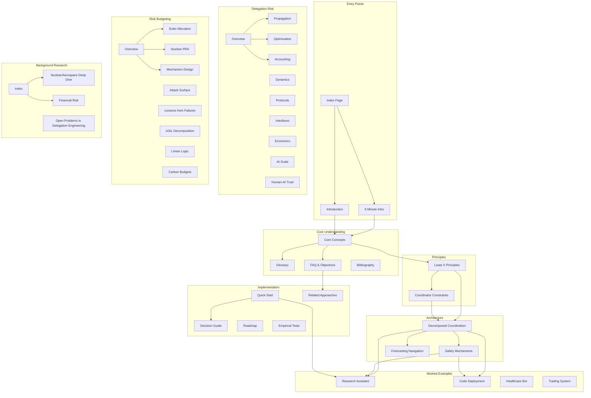

How the documentation is organized and how concepts relate to each other.

## Documentation Structure



## Reading Paths by Audience

### For New Readers
Start here for foundational understanding:

```
1. 5-Minute Intro → 2. Core Concepts → 3. Glossary → 4. Least X Principles
```

### For Busy Readers
Just want the essentials?

```
5-Minute Intro → Quick Start → FAQ
```

### For ML Engineers
Focus on practical implementation:

```
Quick Start → Decision Guide → Least X Principles →
Research Assistant Example → Code Deployment Example → Safety Mechanisms
```

### For Safety Researchers
Deep dive into the formal framework:

```
Core Concepts → Delegation Risk Overview → Risk Inheritance →
Trust Optimization → Coordinator Constraints → Empirical Tests
```

### For Organizations
Risk management perspective:

```
Introduction → Risk Budgeting Overview → Euler Allocation →
Lessons from Failures → Quick Start → Roadmap
```

### For Skeptics
Evidence and comparisons:

```
Introduction → FAQ → Related Approaches → Lessons from Failures →
Empirical Tests → Nuclear/Aerospace Deep Dive
```

## Concept Dependencies

What you need to understand before each major concept:

| Concept | Prerequisites | Recommended First |
|---------|--------------|-------------------|
| **Delegation Risk (Delegation Risk)** | None | Core Concepts |
| **Least X Principles** | Delegation Risk basics | Core Concepts |
| **Coordinator Constraints** | Least X Principles | Least X Principles |
| **Decomposed Coordination** | Least X, Coordinator | Both principle pages |
| **Risk Inheritance** | Delegation Risk, basic graph theory | Delegation Risk Overview |
| **Trust Optimization** | Inheritance, calculus | Risk Inheritance |
| **Euler Allocation** | Basic probability | Risk Budgeting Overview |
| **Fault Trees** | Probability, AND/OR logic | Nuclear Safety PRA |
| **Mechanism Design** | Game theory basics | Risk Budgeting Overview |

## Topic Index

### By Question

| Question | Pages |
|----------|-------|
| **What is this framework?** | Introduction, Core Concepts |
| **How do I apply it?** | Quick Start, Decision Guide, Principles to Practice |
| **What are the principles?** | Least X Principles, Coordinator Constraints |
| **Show me examples** | Research Assistant, Code Deployment, Case Studies (Sydney, Code Review Bot, Near-Miss, Drift) |
| **What's the math?** | Delegation Risk Overview, Risk Propagation, Risk Inheritance, Trust Optimization |
| **How does this relate to X?** | Related Approaches, Background Research |
| **What could go wrong?** | Anti-patterns, Lessons from Failures |
| **What's the evidence?** | Empirical Tests, Nuclear/Aerospace Deep Dive |
| **What's the roadmap?** | Roadmap, [Open Problems in Delegation Engineering](/research/potential-projects/) |

### By Keyword

| Keyword | Primary Page | Related Pages |
|---------|--------------|---------------|
| **Delegation Risk** | Delegation Risk Overview | Core Concepts, Trust Accounting |
| **Decomposition** | Decomposed Coordination | Core Concepts, Least X Principles |
| **Verification** | Safety Mechanisms | Trust Interfaces, Coordinator Constraints |
| **Byzantine** | Safety Mechanisms | Decomposed Coordination |
| **Fault Tree** | Nuclear Safety PRA | Euler Allocation, Risk Budgeting Overview |
| **Scheming** | Coordinator Constraints | Safety Mechanisms, Anti-patterns |
| **Human oversight** | Human-AI Trust | Coordinator Constraints, Safety Mechanisms |
| **Budget** | Risk Budgeting Overview | Euler Allocation, Trust Accounting |

## Page Status

| Section | Pages | Status |
|---------|-------|--------|
| **Overview** | 13 | Complete |
| **Principles** | 2 | Complete |
| **Architecture** | 7 | Complete |
| **Delegation Risk** | 10 | Most complete |
| **Risk Budgeting** | 9 | Complete |
| **Implementation** | 7 | Complete |
| **Background Research** | 6 | Complete |

## Section Details

### Getting Started

| Page | Focus | Time |
|------|-------|------|
| [Overview](/getting-started/) | Problem statement | 10 min |
| [Five-Minute Intro](/getting-started/five-minute-intro/) | Quick overview | 5 min |
| [Core Concepts](/getting-started/core-concepts/) | Visual framework | 20 min |
| [FAQ](/getting-started/faq/) | Common questions | 15 min |
| [Glossary](/getting-started/glossary/) | Term definitions | Reference |
| [Reading Order](/getting-started/reading-order/) | Path guidance | 5 min |
| [Quick Reference](/getting-started/quick-reference/) | Cheat sheet | Reference |
| [Common Mistakes](/getting-started/common-mistakes/) | Anti-patterns | 15 min |
| [For Engineers](/getting-started/for-engineers/) | Implementation | 15 min |
| [Examples Catalog](/getting-started/examples-catalog/) | Example index | Reference |

### Delegation Risk (Theory)

| Page | Focus |
|------|-------|
| [Overview](/delegation-risk/overview/) | Core formula |
| [Walk-Through](/delegation-risk/walkthrough/) | Worked example |
| [Risk Decomposition](/delegation-risk/risk-decomposition/) | Accident vs defection |
| [Risk Propagation](/delegation-risk/risk-propagation/) | The canonical composition rule |
| [Delegation Accounting](/delegation-risk/delegation-accounting/) | Risk budgets |
| [Exposure Cascade](/delegation-risk/exposure-cascade/) | Chain risk |
| [Runtime Risk Accounting](/delegation-risk/runtime-accounting/) | Preflight, exposure envelope, exposure ledger |
| [Insurer's Dilemma](/delegation-risk/insurers-dilemma/) | Who bears risk |

### Power Dynamics (Theory)

| Page | Focus |
|------|-------|
| [Overview](/power-dynamics/) | Power formalization |
| [Agent Power Formalization](/power-dynamics/agent-power-formalization/) | Definitions |
| [Agency & Power Examples](/power-dynamics/agency-power-examples/) | Worked examples |
| [Strong Tools Hypothesis](/power-dynamics/strong-tools-hypothesis/) | High power, low agency |

### Design Patterns

| Category | Examples |
|----------|----------|
| [Least-X Principles](/design-patterns/least-x-principles/) | Privilege, context, autonomy |
| [Structural Patterns](/design-patterns/structural/) | Bulkheads, firewalls |
| [Verification Patterns](/design-patterns/verification/) | Ghost checker, triangulation |
| [Monitoring Patterns](/design-patterns/monitoring/) | Tripwires, probing |
| [Recovery Patterns](/design-patterns/recovery/) | Rollback, degradation |
| [Multi-Agent Patterns](/design-patterns/multi-agent/) | Cross-validation |
| [Tools & Guides](/design-patterns/tools/quick-start/) | Implementation help |
| [Worked Examples](/design-patterns/examples/research-assistant-example/) | Concrete applications |

### Case Studies

| Category | Contents |
|----------|----------|
| [AI Systems](/case-studies/ai-systems/case-study-sydney/) | Sydney, Code Review Bot, Anti-patterns |
| [Human Systems](/case-studies/human-systems/nuclear-launch-authority/) | Nuclear, Jury, Organizations |
| [Power Dynamics Cases](/case-studies/power-dynamics-cases/) | Power in practice |

### Research (selected)

| Page | Focus |
|------|-------|
| [Risk Measurement & Pricing](/research/risk-methods/risk-measurement-and-pricing/) | Coherent measures, complexity pricing, alignment tax |
| [Risk Inheritance Algorithms](/research/theory/trust-propagation/) | Candidate propagation rules and the canonical choice |
| [Empirical Scheming Reduction](/research/trust-behavior/empirical-scheming-reduction/) | Evidence base and game theory of adversarial trust |

## Page Counts by Section

| Section | Pages | Type |
|---------|-------|------|
| Getting Started | 12 | Entry |
| Delegation Risk | 6 | Theory |
| Power Dynamics | 5 | Theory |
| Entanglements | 26 | Theory |
| Design Patterns | 28 | Application |
| Case Studies | 25 | Examples |
| Research | 15 | Theory |
| Experimental | 10 | Tools |
| Reference | 5 | Meta |
| **Total** | **~132** | |

## Quick Links

**Start here**:
- [5-Minute Introduction](/getting-started/five-minute-intro/)
- [Getting Started Overview](/getting-started/)
- [Core Concepts](/getting-started/core-concepts/)
- [Quick Start](/design-patterns/tools/quick-start/)

**Reference**:
- [Glossary](/getting-started/glossary/)
- [FAQ & Objections](/getting-started/faq/)
- [Anti-patterns](/case-studies/ai-systems/anti-patterns/)
- [Bibliography](/reference/bibliography/)
- [Decision Guide](/design-patterns/tools/decision-guide/)

**Deep dives**:
- [Delegation Risk Overview](/delegation-risk/overview/)
- [Risk Budgeting Overview](/cross-domain-methods/overview/)
- [Safety Mechanisms](/design-patterns/safety-mechanisms/)

**Interactive Tools**:
- [Delegation Risk Calculator](/design-patterns/tools/delegation-risk-calculator/)
- [Risk Inheritance](/design-patterns/tools/trust-propagation/)
- [Tradeoff Frontier](/design-patterns/tools/tradeoff-frontier/)

## See Also

- [Reading Order](/getting-started/reading-order/) — Prerequisites and paths
