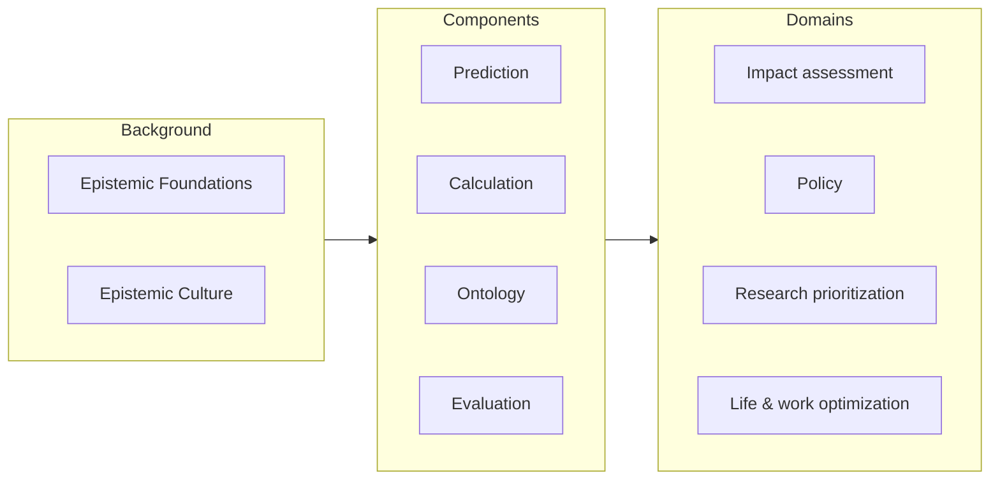

*Status: early draft, adapted from the 2021–22 estimation-theory notes.*

A serious evaluation system decomposes into a small number of reusable parts. Studying and improving each part separately is most of the field's tractable work.

The **background** modules (epistemic foundations, [epistemic culture](/concepts/epistemic-culture/)) are preconditions for a system rather than parts of it. The **domains** are where systems get applied. The **components** in the middle are the active machinery — and the rest of this page.

## Prediction

Quantifiable prediction in the [*Superforecasting*](https://www.goodreads.com/book/show/23995360-superforecasting) sense: the emphasis is on **calibration, scorability, and aggregation**. This is the component that keeps the larger system honest. If outputs can be scored against eventual outcomes, the system has a feedback signal; if predictors can be aggregated, it has a way to combine many cheap judgments.

A prediction component *without* calculation is limited to what people can intuit in their heads — fine for a few hundred hand-written questions, useless at scale.

## Calculation

Calculation, estimation, algorithms, logic — the multi-step machinery that turns raw inputs into derived numbers. If a single estimate requires several steps (a Fermi chain, a model, a spreadsheet), those steps live here.

This is the [estimation](/start-here/estimation-vs-evaluation/) layer's engine. A calculation component *without* prediction can produce elaborate numbers that nobody has any reason to believe are calibrated. The two are complementary: prediction supplies trust, calculation supplies reach.

> The line between prediction and calculation is genuinely fuzzy. A platform full of purely intuitive questions is prediction without calculation; a giant spreadsheet model is calculation that can't claim calibration. You want both, but it helps to separate them for research and for software architecture.

## Ontology

Ontology, taxonomy, definitions, data engineering, knowledge graphs — the **structured list of things the system makes estimates about**, and the data plumbing underneath. Large, well-structured sets of items are what let you predict or calculate over thousands of questions instead of dozens.

The 2021–22 notes single this out as the *suspiciously absent* bottleneck: almost all forecasting platforms rely on small sets of unstructured, hand-written questions, which doesn't scale. Questions like "for each country, each month, for 20 years, what will each of 20 metrics be?" are trivial to *state* and very hard to *structure and forecast* with current tooling. Ontology is plausibly the part where progress is most leveraged and least worked-on.

## Evaluation

Qualitative-and-quantitative judgment on the questions that are abnormally hard — normative, long-horizon, or otherwise lacking clean ground truth. This is the component that handles everything the estimation layer can't reduce, and it is the one most dependent on **trust**: an evaluation only counts if its audience believes it.

Evaluation is typically used as a *target* of prediction: the expensive, trusted judgment is what cheaper predictors are trained and scored against. The menu of concrete methods — expert panels, surveys, review systems, statistical and composite measures — gets its [own page](/concepts/evaluation-methods/).

## How the components combine

The components are not a pipeline so much as a set of interlocking parts:

- **Ontology** defines the questions.
- **Calculation** and **prediction** populate the [estimation](/start-here/estimation-vs-evaluation/) layer over those questions — calculation for reach, prediction for calibration.
- **Evaluation** handles the residue that can't be estimated, and serves as the ground truth that prediction is scored against.

The system-level [techniques](/concepts/techniques/) are mostly about wiring these together cheaply — above all, using a small amount of expensive evaluation to calibrate a large amount of cheap prediction.

## A note on separating them

As with [estimation vs. evaluation](/start-here/estimation-vs-evaluation/), the point of naming four components is not bureaucratic. Each is a distinct research cluster with its own literature, its own tooling needs, and its own failure modes. Keeping them separate is what makes the field tractable; combining them is a comparatively thin integration layer on top.
