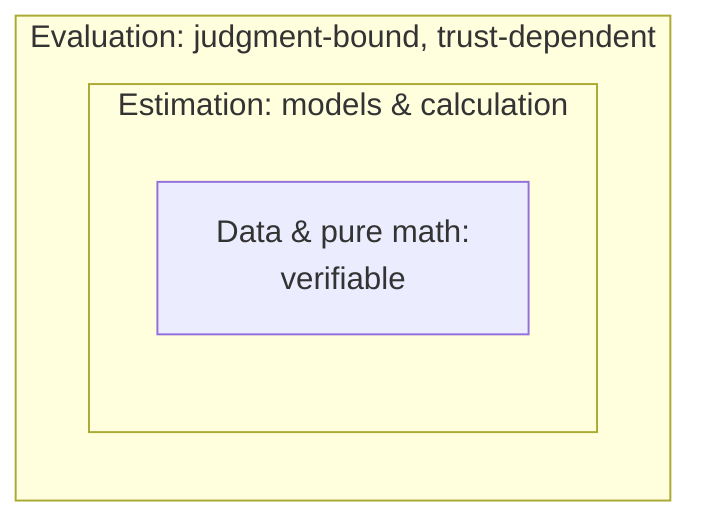

*Status: early draft, adapted from the 2021–22 estimation-theory notes (see [Lineage](/start-here/lineage/)).*

This distinction is the load-bearing one. If you only take one idea from this wiki, take this one.

## Estimation

**Estimation** is the calculation of specific numbers, usually under uncertainty. It is a superset of ordinary numeric calculation: summing itemized expenses is "estimation" with no uncertainty; a Fermi estimate is "estimation" with a lot.

The defining property: the estimator only has to be *correct*. They don't need to worry about how the result is interpreted, who trusts them, or what the number does once released. The challenge is purely accuracy.

Examples:

- How many piano tuners are in Boston right now?
- How many total hours have been spent reading a particular blog post?
- How much do Americans spend on mechanical keyboards per year?

Estimation leans on logic, math, economics, and data engineering.

## Evaluation

**Evaluation** is similar — it also produces a judgment, often numeric — but for things that are *messy*: results that are difficult or impossible to verify or fully trust. Evaluations either avoid formal models or use them as one input among many (à la [cluster thinking](https://blog.givewell.org/2014/06/10/sequence-thinking-vs-cluster-thinking/)).

The defining property: here the *effect on the audience matters*. The number usually needs explanation, the explanation needs to be tailored to readers, and — crucially — the result is only useful if the relevant people *trust* it. An excellent evaluation nobody believes changes nothing.

Examples:

- On a scale of 0–100, how good a job did Barack Obama do as president?
- What is the probability that we live in a simulation?
- How much did organization X reduce existential risk from 2000 to 2020?

Evaluation leans on epistemology, sociology, survey methodology, and the "soft" sciences.

## The distinction is a gradient, not a wall

There is no crisp line. Many real questions sit in between. A rough contrast:

| Estimation | Evaluation |
|---|---|
| Highly quantitative | Highly qualitative |
| Relies on equations/models | Relies on judgment and intuition |
| Easy for parties to agree on | Parties hold different underlying intuitions |
| Little trust in the estimator needed | Lots of trust in the evaluator needed |
| Terminology rarely contested | Terminology frequently contested |
| Minimal explanation | Often substantial explanation |
| Usually numeric | Numeric, grades, scales, or prose |
| Math, programming, data, economics | Economics, sociology, epistemology, mixed methods |

A useful intuition pump: which questions would you hand to *a sharp quantitative analyst* (estimation), and which would you want *a team of trusted domain experts or strong generalists* on (evaluation)?

## Why separate them: divide and conquer

The payoff of the distinction is a design strategy, borrowed from the functional-programming idea of separating pure from impure code:

> Handle as much as possible as **estimation**. Sequester the genuinely judgment-bound parts into a separate **evaluation** layer. Don't let the messiness of one bleed into the cleanliness of the other.

Pushed further, you get **three nested layers**, ordered by how verifiable they are — evaluation on the outside, a verifiable core of data and pure math at the center:

1. **Verifiable** — raw data, mathematical facts, proofs.
2. **Estimation** — derived numbers from models and calculation.
3. **Evaluation** — the irreducibly judgment-bound calls.

The heuristic: *do as much work as possible in the deeper (more verifiable) layers, and keep the layers separate.* Every claim you can demote from "evaluation" to "estimation," and from "estimation" to "verifiable," gets cheaper, more trustworthy, and easier to keep consistent at scale.

## Two notes on naming

- There is already an academic field called **Evaluation** (program evaluation, rooted in the social sciences). It overlaps with this usage but is centered on bespoke studies and long reports rather than high-throughput systems. We borrow lessons but reframe the scope.
- "Estimation" and "evaluation" are deliberately plain, unromantic words. The priority is honest categories that won't collide with existing terminology, not memorable branding. Better names may come later.

## Where this goes

The estimation/evaluation split is what makes the [component architecture](/concepts/components/) coherent: *prediction* and *calculation* mostly serve the estimation layer, *evaluation methods* serve the evaluation layer, and *ontology* organizes the questions both operate on. The system-level [techniques](/concepts/techniques/) — especially prediction–evaluation systems — are largely about cheaply bridging the two.
