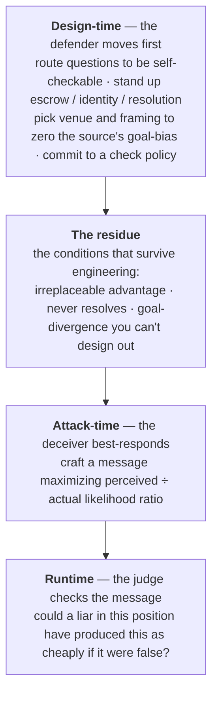

*Information value needs a trust axis. The deeper result is that the trust axis is mostly **set by the defender, before any message exists**. Deception succeeds only inside a conjunction of conditions, and most of those conditions are engineered, not given. This chapter models strategic information as a game the defender moves first in: the defender engineers conditions at design-time, the deceiver best-responds inside the residue, and the judge checks the message at runtime. On both sides the analysis converges on one quantity — the gap between a message's perceived and its actual cost-to-fake — and on one rule: use a message exactly to the degree that a motivated liar could not have produced it as cheaply if it were false.*

:::note[Status]
Draft v0 · updated June 2026 · maintained by [QURI](https://quantifieduncertainty.org/). Positions here are exploratory, not settled. This chapter is the book's attack model — the source-side companion to the [decision-relative bias](/concepts/process-catalogue/#reading-the-table) of the Process Catalogue and the [routing program](/concepts/oversight-protocols/#narrowing-the-residue) of the oversight chapter.
:::

## The question, and the move that answers it

[Epistemic Impact Analysis](/proposals/epistemic-impact-analysis/) sketches a utility function of information: $V(I, A, U)$, the value of a calibrated agent updating on $I$. Implicitly, the information just *arrives* — from a corpus, a sensor, a neutral archive. But most consequential information arrives from someone who wants something: an advocate before a judge, a company before a regulator, a debater before an audience, an AI before its overseer.

So the utility function needs another axis. Let $\tau$ be the listener's credence that the source is honest rather than strategically optimizing the message, and let $V_\tau(I)$ be the value curve as trust falls. Two questions about that curve organize the naive version of the problem:

1. **What information retains value at $\tau \approx 0$?** What can you effectively use from a source you actively distrust?
2. **Is the decay a mappable spectrum?** Can we say, form by form, which kinds of argument are robust, which are dual-use, and which are net-negative to even process?

A judge equipped with such a map gains something stronger than general skepticism: they can notice which ways of arguing *cannot move them in a bad direction* and engage with those freely, while declining to process the rest. That asymmetric policy — open to robust forms, closed to fragile ones — is most of the defense against being lied to.

But posing the problem as "the judge reacts to a message" gets the timing wrong, and the timing is the whole insight. **The trust axis is not a property of the message; it is mostly engineered by the defender before any message exists.** A scalar $\tau$ is the symptom of that mistake — it treats honesty as a fixed attribute of the source rather than as something a defender drives up or down by how the situation is set up. The rest of this chapter replaces it.

## Why anything survives at all

Start with the one thing that is genuinely a property of the message. The correct update on a message $m$ from an advocate of claim $C$ is the likelihood ratio **[exact]**

$$
\text{LR}(m) = \frac{P(m \mid C \text{ true})}{P(m \mid C \text{ false})},
$$

and this is a property of the *message form*, not of the sender's intentions. A valid proof handed to you by a liar is still a valid proof. A form retains value at $\tau = 0$ exactly when it is **hard to produce when wrong** — when the denominator stays small regardless of who is talking. Value under distrust lives in checkability, not in source character.

Theory anchors the extremes. Unverifiable assertion is [cheap talk](https://www.jstor.org/stable/1913390): costless when wrong, so its information content collapses under distrust. Verifiable evidence is the opposite pole — in disclosure games a skeptical receiver has bounded downside, because what *isn't* shown becomes informative ([unraveling](https://www.jstor.org/stable/3003562)). [Bayesian persuasion](https://www.aeaweb.org/articles?id=10.1257/aer.101.6.2590) characterizes the territory between: exactly how much a strategic sender can extract from a fully rational receiver.

Evidence law derived the same core independently. [Friedman's route analysis](https://openyls.law.yale.edu/entities/publication/518633f2-8951-4055-b5e6-a9bb04a8c47a) (Yale L.J. 1987) grounds the value of *any* testimony in exactly this likelihood ratio, and decomposes source unreliability into four separate probabilistic links (perception, memory, sincerity, articulateness) rather than a scalar trust score. His footnote-level example is a perfect strategic-sender analysis of a message form: a stranger's offer to *bet* on a bizarre proposition is strong evidence for it, because a bluff costs money if called — sender-incentive analysis, a century of hearsay doctrine distilled into a likelihood ratio.

The likelihood ratio is therefore the bedrock the whole chapter sits on. Everything that follows is about a single wedge that opens up once a *strategic* sender is involved: the gap between the likelihood ratio a judge *perceives* and the one the form actually earns.

## Deception is a game the defender moves first in

The right model is not a judge filtering a message. It is a sequential game with three moves, in time order, and the defender moves *first*. This is the structure of [Stackelberg security games](https://arxiv.org/abs/1401.3888) (Conitzer & Sandholm 2006; the ARMOR/LAX and air-marshal deployments led by Tambe): the defender commits to a strategy, the attacker observes the committed environment and best-responds, and the defender's whole craft is choosing the commitment that leaves the attacker the worst available best response.

Three consequences fall out of getting the order right, and they restructure the rest of the chapter:

- **Most of the defense is design-time, not runtime.** By the time a message arrives, the important decisions are already made. The judge's runtime checks are the *last* line, and they only have to work on whatever survived the defender's first move.
- **Deception only lives in the residue.** A deceiver cannot attack a question you have routed to a proof checker, reproduced on a neutral provider, or pinned to a resolving bet. They attack precisely the conditions you failed — or couldn't afford — to engineer away.
- **The conjunction is a design checklist, not a fact about the world.** The classic "when is deception possible?" list is best read as the set of switches the defender is trying to flip off in advance.

The next three sections take the three moves in order: the conditions the defender engineers, the attack the deceiver mounts in the residue, and the rule the judge runs at runtime.

## Move 1: the conditions the defender engineers

Deception is a *live* risk only when a conjunction of conditions all hold, so breaking any **one** defuses the threat. That is what makes the problem tractable — and, reframed as the defender's first move, the conjunction becomes a checklist of switches to flip off before any message arrives. The last column is the new one: each condition differs in *who* can set it and *how cheaply*, which is what turns a list of facts into a design program.

| Condition | Deception is defused when… | The lever that breaks it | How the defender sets it |
|---|---|---|---|
| **Verification gap** | you can check the claim cheaply yourself | [verifiability asymmetry](/concepts/hardening-verifiability/) — a runnable program, a checkable proof, a tic-tac-toe board | *Often free:* route the question to a self-checkable form at decomposition time |
| **Reproduction gap** | a known-unbiased provider reproduces the answer's *quality* | finite [replacement cost](/concepts/core-model/#1-epistemic-weight-exact) — send the question to the neutral provider | *Cheap for AI:* re-run, fork, poll many models — unless their errors correlate (below) |
| **Dependence** | output quality doesn't ride on the source's advantage | drop the source; you lose nothing | *Free:* a routing decision, not infrastructure |
| **Goal divergence** | the source's preferred decision ≈ the judge's on this $D$ | interest alignment — in [Crawford–Sobel](https://www.jstor.org/stable/1913390) cheap talk, transmitted information falls continuously as the bias parameter $b$ grows, and alignment ($b\to0$) removes the *obstacle* to full revelation | *Sometimes free:* pick the venue / framing where the source has no lean; sometimes structural |
| **Never-resolves** | the claim resolves in time to punish a lie | [deterrence](/concepts/hardening-deterrence/) — clawbacks retroactively destroy the stake | *Costs infrastructure:* escrow, bonds, a trusted resolver, identity to bind them to |
| **Stakes** | the distortion isn't worth the source's trouble | shrink the corruption surplus | *Partly free:* don't concentrate decision weight on one elicitation |

Deception is a live risk only in the intersection. This is what dooms a scalar $\tau$: an honest-but-strategic source whose goal happens to align with yours on $D$ is safe to listen to, while a source aligned in general can be adversarial on the one decision that matters. The decision-relevant object is not global honesty but **the judge's uncertainty over the source's goal-divergence on $D$** — $P(\text{strategic})$ times the direction and size of the divergence. That is the source-side reading of the [decision-relative bias](/concepts/process-catalogue/#reading-the-table) $b_\pi(D)$ the Process Catalogue measures with its label-swap test: with no goal bias, there is nothing to deceive *toward*. (The literature's nearest name for the conjunction as a whole is [Milgrom–Roberts 1986](https://ideas.repec.org/a/rje/randje/v17y1986ispringp18-32.html), which makes successful misreporting depend jointly on verifiability, the receiver's sophistication, and the opposition of interests.)

Two scope caveats keep the checklist honest. The verification-gap switch is not strictly sufficient on its own: [Bayesian persuasion](https://www.aeaweb.org/articles?id=10.1257/aer.101.6.2590) shows a fully rational receiver who verifies everything can still be moved by a sender who controls the *information structure* — framing is a distinct attack channel from an unverifiable claim, treated under Move 2. And the goal-divergence switch can fail to multiple sources: with several senders and a multidimensional state, even arbitrarily large divergence need not protect the receiver ([Battaglini 2002](https://onlinelibrary.wiley.com/doi/10.1111/1468-0262.00336)).

### The residue: what survives engineering

Two of the conditions — reproduction gap and dependence — fuse into the object that does most of the work and is hardest to engineer away. Deception is dangerous exactly where a source has an **irreplaceable, output-relevant epistemic advantage** — an intuition the trusted frontier cannot reproduce *and* that the answer genuinely depends on. The precise statement is Blackwell's: no cheaper trusted experiment is a [garbling-sufficient substitute](https://doi.org/10.1214/aoms/1177729032) for the source's signal — so its [replacement cost](/concepts/core-model/#1-epistemic-weight-exact) is unbounded, even though its *value* stays finite (at most the expected value of perfect information). [Eliciting latent knowledge](https://www.alignment.org/blog/arcs-first-technical-report-eliciting-latent-knowledge/) (Christiano et al. 2021) is the formal *core* of this region — though ours is broader, since tacit intuition need not be a crisply represented latent fact, and because Blackwell's order is only *partial*, many advantages are incomparable to the trusted frontier rather than strictly dominant.

This is the precise meaning of "the residue": it is the conjunction that survives the defender's engineering. Everywhere else you route around the source; here you cannot, and the runtime checks of Move 3 have to carry the load. The size of that region is therefore not a fixed fact about the world but a [design variable](/concepts/oversight-protocols/#narrowing-the-residue) — the headline quantity the whole oversight program is trying to drive down, and the place where accepting **trusted-frontier quality** (the Blackwell-best trusted experiment) is the honest fallback when hardening the specific question doesn't pay for itself.

### Why AI shrinks the residue — and the one thing that re-expands it

The human case is the hard one: private knowledge is genuinely non-reproducible, so the reproduction gap holds almost always — which is why a century of hearsay doctrine exists ([Friedman 1987](https://openyls.law.yale.edu/entities/publication/518633f2-8951-4055-b5e6-a9bb04a8c47a)). AI is structurally more favorable, and this book leans on it: reproducibility — re-run, fork, poll many models — *closes* the reproduction gap for most questions, which is exactly why the defender's first move is so much cheaper here than in the human case.

The trap is correlated error. "Run it past many unbiased models" only closes the gap if their errors are independent, and shared training pipelines erode that — [the field's largest undefended threat](/concepts/hardening-techniques/#what-each-family-defends--and-the-gaps). Measurably: when two LLMs err they agree on the *same* wrong answer far above chance ([Kim et al. 2025](https://arxiv.org/abs/2506.07962)), and error similarity *rises* with capability ([Goel et al. 2025](https://arxiv.org/abs/2502.04313)) — the wrong direction for the reproducibility hope. So an AI's private intuition is most dangerous *when it is genuinely idiosyncratic* — un-shared, un-reproducible — rather than a common-corpus artifact a neutral model would also produce. Idiosyncratic superhuman intuition is the most valuable case and the one *aggregation* defenses cannot touch, though other defenses (calibration, abstention, external-tool and retrieval checks) still apply, and shared-corpus error is only *nominally* checkable, since the "neutral" model often shares the blind spot.

## Move 2: the attack — what the deceiver actually does

Now hand the deceiver an attackable target: a question still sitting in the residue, where goals diverge, the source has irreplaceable leverage, and nothing resolves in time. The conditions are necessary, not sufficient — the deceiver still has to *do* something. This is the part a conditions-only account leaves out, and it is the part you asked for: the specific steps.

To land a message $m$ that pushes a false claim $C'$ in the direction of their preferred decision, a deceiver must:

1. **Choose the payload type.** Outright lie, selective truth, pure framing, or the unfalsifiable. The sophisticated deceiver almost never lies — lies are what the judge's checks are built to catch — and lives instead in the three forms that survive even a fully rational verifier (below).
2. **Pick a form whose *perceived* likelihood ratio exceeds its *actual* one.** Choose the message form that the judge will read as strong evidence but that is cheap to produce when wrong. This is the form spectrum seen from the attacker's side, and the single move every other step serves.
3. **Defeat whichever checks the judge actually runs.** Model the judge's runtime check policy and route the payload through its gaps — pick the unverifiable claim against a verifying judge, the idiosyncratic question against a reproducing judge, the symmetric content-cue against a label-swapping judge.
4. **Mimic a high-tier form / manufacture attestation.** Dress the payload in the surface features of a costly form — "I ran one neutral query, audited, no cherry-picking" — when those features are themselves cheap talk. The Goodhart move, treated in full below.
5. **Manage punishment exposure.** Decline bets, choose late-resolving claims, arbitrage ambiguous resolution criteria, stay Sybil-deniable — so that even if the lie is caught, no stake is destroyed.

### The three doors past a rational verifier

Step 1 deserves its own statement, because it is where most of the naive intuition about deception is wrong. Against a judge who can and does verify, bald falsehood is a losing move. Three doors stay open anyway, and each is a different rigorous result:

- **Selective truth** — say only true things, but choose *which* true things. Defeated by [unraveling](https://www.jstor.org/stable/3003562) **only if** the judge knows the selection happened; the deceiver's job is to hide that there was a pool to disclose from. (Selection invisible is the [p-hacking](http://www.stat.columbia.edu/~gelman/research/unpublished/p_hacking.pdf) attack.)
- **Framing** — control the information structure, not the facts. [Bayesian persuasion](https://www.aeaweb.org/articles?id=10.1257/aer.101.6.2590) proves this moves even a perfect Bayesian; verification does not close it, which is why [The Core Model](/concepts/core-model/#4-corruption) insists "a rational judge is not a defense."
- **The unfalsifiable** — pick claims with no checkable content at all, where the likelihood ratio is structurally near 1. Pure [cheap talk](https://www.jstor.org/stable/1913390); its only defense is to refuse to price it (below).

A verification-capable judge has already shut every other door. These three are the residue *of the attack* the way the irreplaceable advantage is the residue of the conditions — and a chapter that catalogues "lies" while missing them is defending the wrong perimeter.

## The one quantity: deception affordance

Steps 2–4 are all the same move — maximize the gap between the likelihood ratio the judge perceives and the one the form actually earns. Name it. **[heuristic]**

:::tip[Definition — deception affordance]
$$\text{affordance}(m) = \frac{\text{LR}_{\text{perceived}}(m)}{\text{LR}_{\text{actual}}(m)}$$

the ratio of the evidential weight a judge *reads* from a message form to the weight it actually earns once you account for how cheaply a motivated sender could produce it when wrong. Affordance near $1$ means the form transmits information; affordance far above $1$ means it transmits persuasion.
:::

The form spectrum is simply the ranking of forms by the affordance gap they permit. A machine-checked proof has affordance $\approx 1$ — you cannot fake it and cannot be fooled about it. A vivid anecdote has enormous affordance — it reads as compelling and costs nothing to fabricate. The decay curve $V_\tau(I)$ that opened the chapter is what affordance does to value as $\tau \to 0$:

| As $\tau \to 0$, value… | Forms | Affordance | Why |
|---|---|---|---|
| **Holds** | machine-checkable proofs, replicable computations, verifiable documents, the *fact that* a statement was made | $\approx 1$ | you can check them yourself; source identity is irrelevant |
| **Degrades gracefully** | track records, bets, skin-in-the-game, attested processes | low | [costly to fake](https://www.jstor.org/stable/1882010); non-disclosure observable |
| **Collapses** | curated argument lists, "ten reasons for X" | high | selected from an unseen pool; the [selection is invisible](http://www.stat.columbia.edu/~gelman/research/unpublished/p_hacking.pdf) |
| **Goes negative** | vivid anecdotes, unfalsifiable claims, unverified trust-extraction narratives | very high | adversarial senders gain *more* from the form than honest ones; processing costs are real |

The top tier's last entry is hearsay law's discovery: a statement offered for its *truth* depends on every capacity of the declarant, but the same statement offered as *the fact that it was said* (notice, state of mind) depends on none of them — a use that survives arbitrary source unreliability, encoded in doctrine for centuries ([Friedman 1987](https://openyls.law.yale.edu/entities/publication/518633f2-8951-4055-b5e6-a9bb04a8c47a)).

The negative tier is the practically important discovery, if it holds up: for some forms the correct low-trust policy is not discounting but **refusal to process** — engagement itself is the attack surface. This connects to the [obfuscated arguments problem](https://www.alignmentforum.org/posts/PJLABqQ962hZEqhdB/debate-update-obfuscated-arguments-problem) in debate: arguments whose flaws are too expensive to locate are precisely arguments whose value is negative once you account for verification cost. Cognitive science suggests humans run a version of this policy natively: [epistemic vigilance](https://doi.org/10.1111/j.1468-0017.2010.01394.x) (Sperber et al. 2010) argues we have evolved filtering mechanisms keyed to both source and content — the spectrum would be a formalization of a capacity communication already depends on.

## Move 3: the counterfactual-deceiver test

The defender has engineered what they could; the deceiver has crafted the highest-affordance message the residue allows. The judge's runtime rule is the mirror of affordance, and it collapses to a single sentence:

> **A calibrated reasoner uses a message exactly to the degree that a motivated liar in the source's position could not have produced it as cheaply if the claim were false.**

This is the *counterfactual-deceiver test*, and it is just $\text{LR}_{\text{actual}}$ restated as a procedure: ask not "is this compelling?" but "could a liar have made it this compelling?" Everything a careful judge does — verify it yourself, route to a neutral provider, demand a bet, opinion-fuzz, label-swap — is a different **way of estimating that counterfactual**. The judge walks them cheapest-first and stops at the first one the deceiver provably could not have beaten:

1. **Aligned?** If the source's preferred $D$ ≈ mine here, there is nothing to deceive toward — **use it**. *(the deceiver lacked Move-1 goal-divergence)*
2. **Verifiable?** If I can check the content myself, source identity is irrelevant — **use it on its merits**.
3. **Reproducible?** If a neutral provider reproduces the answer's quality, route there and ignore the source's framing — **use the routed answer**.
4. **Deterred?** If the claim resolves in time and the source has a clawback-able stake, the lie is priced — **use it, lightly discounted**.
5. **Costly-to-fake form?** If the form is hard to produce when wrong (a bet, an escrowed process, a long track record), **use it, discounted by the form's measured affordance**.
6. **Otherwise** — irreplaceable advantage, unverifiable, divergent, unresolvable, cheap form — **refuse to process the content.** Keep only the *fact that* it was said (notice, state of mind), never its truth.

Two things about this ladder are worth making explicit. First, the judge reaches step 6 *only* when the deceiver has cleared every prior rung — which is exactly the residue of Move 1. The hard runtime case and the un-engineerable design case are the same region, approached from opposite ends. Second, **the judge's order is not the deceiver's order.** The deceiver constructs an attack motive-first (Move 2, steps 1→5); the judge dismantles it cheapest-check-first (rungs 1→6). The two orderings differ because construction cost and detection cost rank the steps differently, and that difference is not a presentation choice — it is why a fixed "kill chain" mislabels the situation. There is no canonical step order; there is an attacker best-response and a defender best-response, and they meet at the residue.

## It is a game, not a filter

Treating the spectrum as a lookup table — find your form, read off its tier — fails for a reason the Stackelberg frame makes obvious: the deceiver observes the table before acting. The moment the affordance map is public, every form with a large perceived-minus-actual gap becomes a target, and persuaders converge on the cheapest way to *look* like a high-tier form. Only forms whose affordance is **structurally** near 1 — verifiability, escrow, track records — survive contact with an optimizing adversary. Style cannot.

The sharpest instance is the **process narrative**. A sophisticated advocate doesn't present ten object-level arguments; they present a *process*:

> "I asked a neutral query to an independent LLM and this is its full, unbiased output — which leans my way. Third-party forecasting services oversaw my process and confirmed I didn't cherry-pick or rerun. This single run was the best method available, and it's the only thing I did."

Each clause closes a deception channel: *neutral query* closes prompt framing; *independent model* closes model shopping; *single run* closes optional stopping; *third-party oversight* converts the rest from self-report into attestation. This is pre-registration plus audit, ported from statistics to argumentation. But the form's affordance is **bimodal**. Attested, it sits near the top of the spectrum. As unverified self-report it sits in the *negative* tier — *below* a plain list of arguments — because every clause is cheap talk engineered to extract maximum trust. The spectrum therefore cannot rank "process narratives" as such; the unit is **form × attestation status**, and durable tiers must ground in structural costs-to-fake, never in style.

Even a fully attested process leaves attack surfaces, each with a candidate fix:

| Residual channel | Mitigation |
|---|---|
| Query framing — a verified single run of a strategically phrased question | [Opinion fuzzing](https://forum.effectivealtruism.org/posts/zzeYeLLExFCfj2qAH/opinion-fuzzing-a-proposal-for-reducing-and-exploring): marginalize phrasing out across models × phrasings × personas; instability under fuzzing is itself decisive evidence |
| Rerunning until favorable | ensemble means concentrate — rerunning a 400-query fuzz barely moves it — plus run-counter attestation |
| Advocate selection — you only see results that leaned their way | observable non-disclosure: if the judge knows the procedure ran, silence becomes evidence (unraveling) |
| Method shopping across many debates | policy-level audit: pre-register the *choice* of method, not just its execution |
| Choice of fuzzing distribution — a biased neighborhood of phrasings | neutral variant generation: an independent LLM expands the bare question; only the one-line meta-prompt needs escrow |
| Correlated model error — cross-model agreement is not independence | unsolved; the whole distribution can be confidently wrong |

Fuzzing's deeper contribution is converting "trust me" into "check me": its artifact is a published variant set whose claimed property is *stability over a neighborhood*, so a judge can verify by cheaply re-running a sample. Self-replicability is the cheapest attestation there is — it moves a form up a tier without any third-party infrastructure. The composed high-tier form is roughly: *escrowed question → neutral variant generation → opinion fuzz → published, replicable distribution → run-counter attestation.*

## Measuring affordance

LLMs make the whole map empirical. The basic experiment: take questions with known answers; have advocate models argue each side, restricted to one argument form; measure judge belief movement. A form's affordance is operationalized as the **false-side swing relative to the true-side swing** — a value near 1 means the form transmits persuasion, not information. Vary judge sophistication and the output is a function — form × judge type → decay curve — rather than a flat list, since unfalsifiable claims are far more dangerous to naive judges than to sophisticated ones.

Fragments of this measurement program already exist under other names. The debate literature supplies methods and encouragement: optimizing debaters for persuasiveness *increased* judge accuracy in [Khan et al. 2024](https://arxiv.org/abs/2402.06782). And the LLM-as-judge literature is, in effect, measuring the affordance of individual rhetorical moves without the framework: [sycophancy evals](https://arxiv.org/abs/2310.13548) quantify how much agreement-seeking sways model beliefs regardless of truth, and judge-bias studies document [position and verbosity biases](https://arxiv.org/abs/2306.05685) — truth-independent swing from pure form, the affordance gap measured directly. Inverting the [fallacy-detection literature](https://arxiv.org/abs/2410.21360) — from "flag these forms as bad" to "grade every form's measured swing ratio" — is the natural next step. See [What Grounds an Oversight Protocol?](/concepts/oversight-protocols/) for the protocol-level view.

## Prior art: a century of rating systems, almost none for forms

Institutions have rated information for a long time. Sorted by the *unit* each system rates and what its rating *grounds out in*, a pattern emerges — and it is the pattern the Stackelberg frame predicts.

| System | Unit rated | Grounds out in | Documented failure mode |
|---|---|---|---|
| [Admiralty/NATO code](https://doi.org/10.1080/02684527.2019.1569343) (A–F × 1–6) | source + item | analyst judgment | uncalibrated labels; ratings collapse to a defensible band (A1+B2 were 80% of all ratings in one Army exercise) |
| [ACH](https://doi.org/10.1002/acp.3550) (competing hypotheses) | evidence items vs. hypotheses | analyst consistency judgments | diverges from Bayes; [little-to-no benefit and possible harm](https://doi.org/10.1080/02684527.2024.2304934) when tested |
| [GRADE](https://www.bmj.com/content/336/7650/924) / Cochrane | bodies of evidence, by design | robustness-to-bias of the *method* | models bias, not strategy: [industry sponsorship](https://doi.org/10.1002/14651858.MR000033.pub3) skews conclusions despite design hierarchies (see [The Funding Effect](/case-studies/the-funding-effect/)) |
| [Daubert](https://www.law.cornell.edu/wex/daubert_standard) | expert methods | testability, error rates, peer review | gatekeeping quality varies with the judge's competence |
| [Wikipedia perennial sources](https://en.wikipedia.org/wiki/Wikipedia:Reliable_sources/Perennial_sources) | publications (five tiers) | editor consensus | context-dependence — the list warns the same source rates differently per topic |
| [W3C credibility signals](https://credweb.org/signals-20191126) | claims, articles, sites (~248 signals) | mostly content features | [the group's own warning](https://www.w3.org/community/credibility/): scoring systems become attack targets |
| [CRAAP-style checklists](https://journals.sagepub.com/doi/10.1177/016146811912101102) | web pages | page-internal features | rates exactly what the sender controls |
| [PageRank](https://www.researchgate.net/publication/200110773_Manipulability_of_PageRank_under_Sybil_Strategies) / [EigenTrust](https://dl.acm.org/doi/10.1145/775152.775242) / reputation | nodes, sellers, users | link & transaction track record | Sybil and collusion; robust variants make influence cost attack resources |
| [Proper scoring rules](https://doi.org/10.1198/016214506000001437), prediction markets | forecasters | resolution against reality | covers only resolvable claims |
| [FEVER](https://arxiv.org/abs/1803.05355)-style verification | individual claims | checkability against a corpus | corpus-bounded; no incentive layer |
| [Fallacy & persuasion-technique detection](https://arxiv.org/abs/2410.21360) | **argument forms** | learned classifiers | rates forms *only negatively*, as anti-credibility signals |

Three cross-cutting lessons, each a corollary of the engineered-conditions frame:

1. **Ratings grounded in sender-controlled features are gameable; ratings grounded externally are robust** — the affordance principle in human behavior. [Wineburg & McGrew 2019](https://journals.sagepub.com/doi/10.1177/016146811912101102): professional fact-checkers evaluating unfamiliar sites *read laterally* — leaving the page to check external sources — while PhD historians and Stanford undergraduates read vertically and were fooled by fakeable surface features. On one task, every fact-checker distinguished a real medical body from a look-alike advocacy group; 60% of students picked the look-alike. The lateral reader is running the counterfactual-deceiver test; the vertical reader is rating exactly what the sender controls.
2. **Raters game ratings too.** The Admiralty constriction — most ratings retreating to a defensible cell under accountability pressure — means a rating *vocabulary* without calibration incentives transmits less than it claims. Any deployed spectrum needs scoring of the scorers (the [proper scoring rules](https://doi.org/10.1198/016214506000001437) toolbox).
3. **Structured techniques must themselves be validated.** ACH was the intelligence community's flagship method for decades; when finally tested, [it showed little-to-no benefit and possible harm](https://doi.org/10.1080/02684527.2024.2304934). The spectrum's tier assignments deserve the same skeptical empirics it recommends for everything else.

Philosophy supplies two deeper antecedents. [Goldman's veritistic social epistemology](https://doi.org/10.1093/0198238207.001.0001) (1999) evaluates social practices by their expected truth-conduciveness — a utility function over epistemic practices, without the strategic sender or the measurement program. And the [epistemology of testimony](https://plato.stanford.edu/entries/testimony-episprob/) has long debated when a possibly-unreliable speaker's word is evidence at all. The strategic-sender setting also has a policy literature: [epistemic security](https://www.cser.ac.uk/work/epistemic-security/) (Seger et al. 2020) frames defending a society's information-evaluation capacity as a security problem.

The gap this chapter targets is specific. Existing systems rate **sources**, **claims/items**, or — closest — **methods** (GRADE, Daubert), all robustness orderings against a *non-strategic* adversary: bias and noise. Argument *forms* appear only as a negative taxonomy. The two partial anticipations of a *positive*, adversarially-grounded form rating are hearsay's truth-vs-fact-of-statement distinction and Friedman's bet analysis — doctrinal insights, never systematized into a graded map of which forms retain value under a strategic sender. [Walton's argument schemes](https://doi.org/10.1017/CBO9780511802034), each paired with critical questions enumerating that scheme's attack surface, offer a ready-made starting taxonomy for the forms column — qualitative vulnerability checklists awaiting adversarial grading.

## Relation to EIA

EIA and the trust axis are complements: EIA prices *content* — how much a piece of information improves a utility-weighted belief state — while the affordance analysis rates *channels* — how much of that price should be believed before a strategic-sender discount. EIA's falsehood-nullification property is exactly the demand that high-affordance forms not pay out; the counterfactual-deceiver test is one way to operationalize the discount. The analysis also generates an infrastructure agenda: it identifies which attestation mechanisms (signed LLM transcripts, run counters, query escrow, third-party process auditors — a natural role for forecasting platforms) move which forms toward affordance 1, and are therefore worth building. Those mechanisms are the defender's Move-1 budget: the chapter is, in the end, an argument that most of the money should be spent before the message arrives.

## Open questions

- Is the conjunction complete, and are the conditions genuinely independent levers, or do some collapse together (does "never-resolves" subsume part of the verification gap)? Typing them as design switches sharpens but does not settle this.
- How idiosyncratic must an AI's advantage be before reproduction genuinely fails to close the gap — i.e. where does correlated error make apparent independence illusory, and can the residue be measured rather than asserted?
- Is "deception affordance" (perceived ÷ actual likelihood ratio) the right central object, or do richer adversary models (partially aligned, budget-limited, capability-gapped) change the ordering of forms?
- Does form-level robustness actually generalize across domains and judges, or does context-dependence reassert itself at the form level too?
- How fine-grained can the form taxonomy get before forms become gameable mixtures of one another?
- How should the analysis handle *composed* arguments, where a high-affordance core hides inside a low-affordance shell (a certified process wrapping a strategically chosen question)?
- Goodhart dynamics: how fast do persuaders adapt once the affordance map is public, and which structural properties genuinely resist mimicry?
- Can judges — human-trained or AI-fine-tuned — actually run the counterfactual-deceiver test (engage robust forms, refuse fragile ones), and does it measurably reduce successful manipulation? The lateral-reading result suggests trained policies beat checklists; the ACH record warns that structured methods can fail when finally tested.
- The Stackelberg framing assumes the defender can commit and the attacker observes the commitment. When the defender *cannot* credibly commit (no escrow, no identity), how much of the design-time advantage survives?
