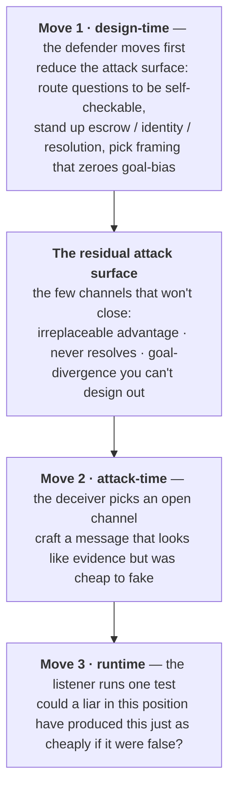

*Most consequential information comes from someone who wants something. The usual response is to ask how much to trust the source — the wrong question, because most of the defense against being lied to happens **before the source ever speaks**. This chapter models strategic information as a security game the defender moves first in: you reduce the attack surface by design, a few channels never close, and on those the whole problem collapses to one idea — a message is worth only what it would have cost a liar to fake.*

:::note[Status]
Draft v0 · updated June 2026 · maintained by [QURI](https://quantifieduncertainty.org/). Positions here are exploratory, not settled. This chapter is the book's attack model — the source-side companion to the [decision-relative bias](/concepts/process-catalogue/#reading-the-table) of the Process Catalogue and the [routing program](/concepts/oversight-protocols/#narrowing-the-residue) of the oversight chapter.
:::

## The one idea

[Epistemic Impact Analysis](/proposals/epistemic-impact-analysis/) prices information on the assumption that it just *arrives* — from a corpus, a sensor, a neutral archive. But most information that matters arrives from someone who wants something: an advocate before a judge, a company before a regulator, a debater before an audience, an AI before its overseer. The naive fix is a trust score for the source. This chapter argues for a different move, and a single idea underneath it.

The idea is borrowed from [costly-signaling theory](https://ocw.mit.edu/courses/15-025-game-theory-for-strategic-advantage-spring-2015/c7de229ffadd7fb5dfe1d01b52f8ea48_MIT15_025S15_Lec_19.pdf): a message is credible exactly when it is cheap to send when true but expensive to fake when false. Stated as advice to a listener:

> **A message is worth only what it would have cost a liar to fake.** Don't ask whether an argument is convincing. Ask whether a liar could have made it *just as* convincing.

Everything else in the chapter is this idea worked out on both sides of the table. The defender's job, it turns out, is mostly done *before* any message exists — by arranging the situation so that the questions which matter can't be cheaply faked in the first place. What survives that arrangement is a small set of channels where faking is cheap and unavoidable, and there the listener falls back on the test above. The plan:

1. **Why anything survives distrust at all** — the likelihood-ratio bedrock the one idea sits on.
2. **Deception is a game the defender moves first in** — and why that reorders everything.
3. **Move 1 — reduce the attack surface** (design-time): close as many channels as you can before the source speaks.
4. **Move 2 — the deceiver picks an open channel**: the specific things a liar must do on whatever you couldn't close.
5. **Move 3 — the test** (runtime): the one question a listener asks about the message that comes through.

A worked-out spectrum of argument forms, a measurement program, and a survey of prior rating systems follow.

## Why anything survives distrust at all

Start with the one thing that is genuinely a property of the message, not of the speaker. The correct update on a message $m$ from an advocate of claim $C$ is the likelihood ratio **[exact]**

$$
\text{LR}(m) = \frac{P(m \mid C \text{ true})}{P(m \mid C \text{ false})},
$$

and this depends on the *message form*, not the sender's intentions. A valid proof handed to you by a liar is still a valid proof. A form keeps its value even from a source you actively distrust exactly when it is **hard to produce when wrong** — when the denominator stays small no matter who is talking. That denominator *is* the cost-to-fake of the one idea: a small denominator means a liar would rarely be able to produce this message, so producing it counts as evidence. Value under distrust lives in checkability, not in source character.

Theory anchors the extremes. Unverifiable assertion is [cheap talk](https://www.jstor.org/stable/1913390): costless when wrong, so its information content collapses under distrust. Verifiable evidence is the opposite pole — in disclosure games a skeptical receiver has bounded downside, because what *isn't* shown becomes informative ([unraveling](https://www.jstor.org/stable/3003562)). [Bayesian persuasion](https://www.aeaweb.org/articles?id=10.1257/aer.101.6.2590) characterizes the territory between: exactly how much a strategic sender can extract from a fully rational receiver. And [costly signaling](https://ocw.mit.edu/courses/15-025-game-theory-for-strategic-advantage-spring-2015/c7de229ffadd7fb5dfe1d01b52f8ea48_MIT15_025S15_Lec_19.pdf) (Spence) supplies the mechanism by which honesty survives conflicting interests: a signal too costly for a liar to mimic separates the honest from the strategic on its own.

Evidence law derived the same core independently. [Friedman's route analysis](https://openyls.law.yale.edu/entities/publication/518633f2-8951-4055-b5e6-a9bb04a8c47a) (Yale L.J. 1987) grounds the value of *any* testimony in exactly this likelihood ratio, and his footnote-level example is a perfect cost-to-fake analysis of a message form: a stranger's offer to *bet* on a bizarre proposition is strong evidence for it, because a bluff costs money if called — a century of hearsay doctrine distilled into a likelihood ratio.

So the one idea is not a metaphor; it is the likelihood ratio read from the listener's chair. The rest of the chapter is about who gets to set that ratio, and when.

## Deception is a game the defender moves first in

The naive picture is a listener filtering an incoming message. The right picture is a sequential game with three moves in time order, and **the defender moves first**. This is the structure of [Stackelberg security games](https://arxiv.org/abs/1401.3888) (Conitzer & Sandholm 2006; the ARMOR/LAX and air-marshal deployments led by Tambe): the defender commits to a strategy, the attacker observes the committed environment and best-responds, and the defender's whole craft is choosing the commitment that leaves the attacker the worst available best response.

Borrowing the security term: the set of routes a strategic sender could use to move you is an **attack surface**, and each specific route is a **channel** (an attack vector). Three consequences follow from getting the order right, and they organize the rest of the chapter:

- **Most of the defense is design-time, not runtime.** By the time a message arrives, the important decisions are already made. The listener's runtime test is the *last* line, working only on whatever channels survived Move 1.
- **Deception lives only in the channels you couldn't close.** A liar cannot attack a question you have routed to a proof checker, reproduced on a neutral model, or pinned to a resolving bet. They attack precisely the routes you failed — or couldn't afford — to close.
- **The famous "conditions for deception" are a design checklist, not facts about the world.** What used to be read as "is deception possible here?" becomes "which channels can I close before anyone speaks, and which are stuck open?"

Throughout, keep one concrete case in view: an AI advocate trying to nudge its overseer toward approving a plan. We will watch the overseer shrink the advocate's options at Move 1, watch the advocate get boxed into one channel at Move 2, and watch the overseer's test fire at Move 3.

## Move 1: reduce the attack surface

Deception is a *live* risk only when a conjunction of conditions all hold, so breaking **any one** routes a question to safety. Read forward, as the defender's first move, the conjunction becomes a checklist of channels to close before a message exists. The last column is the point: channels differ in *who* can close them and *how cheaply*, which is what turns a list of facts into a design program.

| Channel (precondition) | Closed when… | The lever | What closing it costs the defender |
|---|---|---|---|
| **Verification gap** | you can check the claim cheaply yourself | [verifiability asymmetry](/concepts/hardening-verifiability/) — a runnable program, a checkable proof, a tic-tac-toe board | *Often free:* route the question to a self-checkable form at decomposition time |
| **Reproduction gap** | a known-unbiased provider reproduces the answer's *quality* | finite [replacement cost](/concepts/core-model/#1-epistemic-weight-exact) — send the question to the neutral provider | *Cheap for AI:* re-run, fork, poll many models — unless their errors correlate (below) |
| **Dependence** | output quality doesn't ride on the source's advantage | drop the source; you lose nothing | *Free:* a routing decision, not infrastructure |
| **Goal divergence** | the source's preferred decision ≈ the listener's on this $D$ | interest alignment — in [Crawford–Sobel](https://www.jstor.org/stable/1913390) cheap talk, transmitted information falls continuously as the bias $b$ grows, and alignment ($b\to0$) removes the obstacle to full revelation | *Sometimes free:* pick the venue / framing where the source has no lean; sometimes structural |
| **Never-resolves** | the claim resolves in time to punish a lie | [deterrence](/concepts/hardening-deterrence/) — clawbacks retroactively destroy the stake | *Costs infrastructure:* escrow, bonds, a trusted resolver, identity to bind them to |
| **Stakes** | the distortion isn't worth the source's trouble | shrink the corruption surplus | *Partly free:* don't concentrate decision weight on one elicitation |

Our overseer works down this list. Most of the advocate's sub-claims are checkable, reproducible on a neutral model, or will resolve — so they leave the attack surface entirely. This is also what dooms a scalar trust score: an honest-but-strategic source whose goal happens to align with yours on $D$ is safe to listen to, while a source you trust in general can be adversarial on the one decision that matters. The decision-relevant object is not global honesty but **the listener's uncertainty over the source's goal-divergence on $D$** — the source-side reading of the [decision-relative bias](/concepts/process-catalogue/#reading-the-table) $b_\pi(D)$ the Process Catalogue measures with its label-swap test. With no goal bias, there is nothing to deceive *toward*. (The literature's nearest name for the whole conjunction is [Milgrom–Roberts 1986](https://ideas.repec.org/a/rje/randje/v17y1986ispringp18-32.html), which makes successful misreporting depend jointly on verifiability, the receiver's sophistication, and the opposition of interests.)

Two caveats keep the checklist honest. Closing the verification gap is not by itself sufficient: [Bayesian persuasion](https://www.aeaweb.org/articles?id=10.1257/aer.101.6.2590) shows a fully rational receiver who verifies everything can still be moved by a sender who controls the *information structure* — framing is its own channel, handled at Move 2. And the goal-divergence channel can stay open against multiple sources: with several senders and a multidimensional state, even arbitrarily large divergence need not protect the receiver ([Battaglini 2002](https://onlinelibrary.wiley.com/doi/10.1111/1468-0262.00336)).

### The residual attack surface

Two channels — reproduction gap and dependence — fuse into the one that does most of the work and is hardest to close. Deception is dangerous exactly where a source has an **irreplaceable, output-relevant epistemic advantage**: an intuition the trusted frontier cannot reproduce *and* that the answer genuinely depends on. The precise statement is Blackwell's: no cheaper trusted experiment is a [garbling-sufficient substitute](https://doi.org/10.1214/aoms/1177729032) for the source's signal — so its [replacement cost](/concepts/core-model/#1-epistemic-weight-exact) is unbounded, even though its *value* stays finite (at most the expected value of perfect information). [Eliciting latent knowledge](https://www.alignment.org/blog/arcs-first-technical-report-eliciting-latent-knowledge/) (Christiano et al. 2021) is the formal core of this region — though ours is broader, since tacit intuition need not be a crisply represented latent fact, and because Blackwell's order is only *partial*, many advantages are incomparable to the trusted frontier rather than strictly dominant.

This is the **residual attack surface**: the channels that survive every attempt to close them. Everywhere else you route around the source; here you can't, and Move 3's runtime test has to carry the load. The size of this surface is therefore not a fixed fact about the world but a [design variable](/concepts/oversight-protocols/#narrowing-the-residue) — the headline quantity the whole oversight program is trying to drive down — and the place where accepting **trusted-frontier quality** (the Blackwell-best trusted experiment) is the honest fallback when hardening a specific question doesn't pay for itself.

### Why AI shrinks the surface — and the one channel that reopens it

The human case is the hard one: private knowledge is genuinely non-reproducible, so the reproduction gap holds almost always — which is why a century of hearsay doctrine exists ([Friedman 1987](https://openyls.law.yale.edu/entities/publication/518633f2-8951-4055-b5e6-a9bb04a8c47a)). AI is structurally more favorable, and the book leans on it: reproducibility — re-run, fork, poll many models — *closes* the reproduction gap for most questions, which is exactly why the defender's first move is so much cheaper here.

The trap is correlated error. "Run it past many unbiased models" only closes the channel if their errors are independent, and shared training pipelines erode that — [the field's largest undefended threat](/concepts/hardening-techniques/#what-each-family-defends--and-the-gaps). Measurably: when two LLMs err they agree on the *same* wrong answer far above chance ([Kim et al. 2025](https://arxiv.org/abs/2506.07962)), and error similarity *rises* with capability ([Goel et al. 2025](https://arxiv.org/abs/2502.04313)) — the wrong direction for the reproducibility hope. So an AI's private intuition is most dangerous *when it is genuinely idiosyncratic* — un-shared, un-reproducible — rather than a common-corpus artifact a neutral model would also produce. Idiosyncratic superhuman intuition is the most valuable case and the one *aggregation* defenses cannot touch, though other defenses (calibration, abstention, external-tool and retrieval checks) still apply.

## Move 2: the deceiver picks an open channel

Now give the deceiver an attackable target — a question still on the residual surface, where goals diverge, the source has irreplaceable leverage, and nothing resolves in time. The conditions are necessary, not sufficient: the deceiver still has to *do* something. This is the part a conditions-only account omits, and it is the part you actually want — the specific steps.

To land a message $m$ pushing a false claim $C'$ toward their preferred decision, a deceiver must:

1. **Choose the payload type** — outright lie, selective truth, pure framing, or the unfalsifiable. The sophisticated deceiver almost never lies; lies are what the listener's test is built to catch.
2. **Pick a form that *looks* like strong evidence but was cheap to fake.** Choose the message whose perceived likelihood ratio is high but whose true cost-to-fake-when-wrong is low. Every other step serves this one.
3. **Route the payload through the listener's open channels.** Model which checks the listener actually runs and slip past them — the unverifiable claim against a verifying listener, the idiosyncratic question against a reproducing one.
4. **Dress it as a costly form / manufacture attestation** — give cheap talk the surface features of an expensive signal ("I ran one neutral query, audited, no cherry-picking"). The Goodhart move, treated below.
5. **Manage punishment exposure** — decline bets, choose late-resolving claims, arbitrage ambiguous resolution criteria, stay Sybil-deniable — so that even a caught lie destroys no stake.

### The three channels that stay open past a rational verifier

Step 1 deserves its own statement, because it is where most intuition about deception goes wrong. Against a listener who can and does verify, bald falsehood is a losing move. Three channels stay open anyway, and each is a different rigorous result:

- **Selective truth** — say only true things, but choose *which*. Closed by [unraveling](https://www.jstor.org/stable/3003562) **only if** the listener knows a selection happened; the deceiver's job is to hide that there was a pool to disclose from (the [p-hacking](http://www.stat.columbia.edu/~gelman/research/unpublished/p_hacking.pdf) attack).
- **Framing** — control the information structure, not the facts. [Bayesian persuasion](https://www.aeaweb.org/articles?id=10.1257/aer.101.6.2590) proves this moves even a perfect Bayesian; verification does not close it, which is why [The Core Model](/concepts/core-model/#4-corruption) insists "a rational judge is not a defense."
- **The unfalsifiable** — claims with no checkable content, where the likelihood ratio is structurally near 1. Pure [cheap talk](https://www.jstor.org/stable/1913390); the only defense is to refuse to price it.

A verification-capable listener has already shut every other channel. These three are the residue *of the attack* the way the irreplaceable advantage is the residue *of the conditions* — and a chapter that catalogues "lies" while missing them defends the wrong perimeter. Our boxed-in advocate, unable to lie outright, is now forced into exactly here: a true-but-selective, favorably-framed, hard-to-falsify presentation.

## Move 3: the test

The defender has closed what they could; the deceiver has crafted the most evidence-shaped message the open channels allow. The listener's runtime rule is the one idea, read as a procedure:

> **Use a message exactly to the degree that a motivated liar in the source's position could not have produced it as cheaply if the claim were false.**

This is the *counterfactual-deceiver test*. Everything a careful listener does — verify it yourself, route to a neutral model, demand a bet, opinion-fuzz, label-swap — is just a different **way of estimating that counterfactual**. The listener walks them cheapest-first and stops at the first one a deceiver provably couldn't have beaten:

1. **Aligned?** If the source's preferred $D$ ≈ mine here, there is nothing to deceive toward — **use it**.
2. **Verifiable?** If I can check the content myself, source identity is irrelevant — **use it on its merits**.
3. **Reproducible?** If a neutral provider reproduces the answer's quality, route there and ignore the source's framing — **use the routed answer**.
4. **Deterred?** If the claim resolves in time and the source has a clawback-able stake, the lie is priced — **use it, lightly discounted**.
5. **Costly-to-fake form?** If the form is hard to produce when wrong (a bet, an escrowed process, a long track record), **use it, discounted by how cheaply it could still be faked**.
6. **Otherwise** — irreplaceable, unverifiable, divergent, unresolvable, cheap form — **refuse to process the content.** Keep only the *fact that* it was said (notice, state of mind), never its truth.

Two things about this ladder matter. First, the listener reaches rung 6 *only* when the deceiver has cleared every prior rung — which is exactly the residual attack surface of Move 1. The hard runtime case and the un-closeable design case are the same region, reached from opposite ends. Second, **the listener's order is not the deceiver's order.** The deceiver builds an attack motive-first (Move 2, steps 1→5); the listener dismantles it cheapest-check-first (rungs 1→6). Construction cost and detection cost rank the steps differently, which is why there is no single canonical "kill chain" — there is an attacker best-response and a defender best-response, and they meet on the residual surface.

## The spectrum of forms

Run the test across every kind of argument and you get a spectrum: forms sorted by how cheaply a liar could fake them, which is how fast their value decays as trust falls.

| As trust falls, value… | Forms | Why |
|---|---|---|
| **Holds** | machine-checkable proofs, replicable computations, verifiable documents, the *fact that* a statement was made | you can check them yourself; source identity is irrelevant |
| **Degrades gracefully** | track records, bets, skin-in-the-game, attested processes | [costly to fake](https://www.jstor.org/stable/1882010); non-disclosure is observable |
| **Collapses** | curated argument lists, "ten reasons for X" | selected from an unseen pool; the [selection is invisible](http://www.stat.columbia.edu/~gelman/research/unpublished/p_hacking.pdf) |
| **Goes negative** | vivid anecdotes, unfalsifiable claims, unverified trust-extraction narratives | adversarial senders gain *more* from the form than honest ones; processing costs are real |

The top tier's last entry is hearsay law's discovery: a statement offered for its *truth* depends on every capacity of the declarant, but the same statement offered as *the fact that it was said* (notice, state of mind) depends on none of them — a use that survives arbitrary source unreliability, encoded in doctrine for centuries ([Friedman 1987](https://openyls.law.yale.edu/entities/publication/518633f2-8951-4055-b5e6-a9bb04a8c47a)).

The negative tier is the practically important discovery, if it holds up: for some forms the correct low-trust policy is not discounting but **refusal to process** — engagement itself is the channel. This connects to the [obfuscated arguments problem](https://www.alignmentforum.org/posts/PJLABqQ962hZEqhdB/debate-update-obfuscated-arguments-problem) in debate: arguments whose flaws are too expensive to locate are precisely arguments whose value is negative once you account for verification cost. Cognitive science suggests humans run a version of this natively: [epistemic vigilance](https://doi.org/10.1111/j.1468-0017.2010.01394.x) (Sperber et al. 2010) argues we have evolved filtering keyed to both source and content — the spectrum would formalize a capacity communication already depends on.

## It's a game, not a lookup table

Treating the spectrum as a table — find your form, read off its tier — fails for a reason the security framing makes obvious: the deceiver reads the table too. The moment a form's tier is public, every form that *looks* more credible than it is becomes a target, and persuaders converge on the cheapest way to *look* like a high-tier form. Only forms that are hard to fake **structurally** — verifiability, escrow, track records — survive an optimizing adversary. Style cannot.

The sharpest instance is the **process narrative** — and it is where our advocate ends up. Boxed out of object-level lies, they present a *process*:

> "I asked a neutral query to an independent LLM and this is its full, unbiased output — which leans my way. Third-party forecasting services oversaw my process and confirmed I didn't cherry-pick or rerun. This single run was the best method available, and it's the only thing I did."

Each clause closes a deception channel: *neutral query* closes prompt framing; *independent model* closes model shopping; *single run* closes optional stopping; *third-party oversight* converts the rest from self-report into attestation. This is pre-registration plus audit, ported from statistics to argumentation. But the form is **bimodal**. *Attested*, it sits near the top of the spectrum. As *unverified self-report* it sits in the negative tier — *below* a plain list of arguments — because every clause is cheap talk engineered to extract maximum trust. So the spectrum cannot rank "process narratives" as such; the unit is **form × attestation status**, and durable tiers must ground in structural cost-to-fake, never in style.

Even a fully attested process leaves channels open, each with a candidate fix:

| Residual channel | Mitigation |
|---|---|
| Query framing — a verified single run of a strategically phrased question | [Opinion fuzzing](https://forum.effectivealtruism.org/posts/zzeYeLLExFCfj2qAH/opinion-fuzzing-a-proposal-for-reducing-and-exploring): marginalize phrasing across models × phrasings × personas; instability under fuzzing is itself decisive evidence |
| Rerunning until favorable | ensemble means concentrate — rerunning a 400-query fuzz barely moves it — plus run-counter attestation |
| Advocate selection — you only see runs that leaned their way | observable non-disclosure: if the listener knows the procedure ran, silence becomes evidence (unraveling) |
| Method shopping across many debates | policy-level audit: pre-register the *choice* of method, not just its execution |
| Correlated model error — cross-model agreement is not independence | unsolved; the whole distribution can be confidently wrong |

Fuzzing's deeper contribution is converting "trust me" into "check me": its artifact is a published variant set whose claimed property is *stability over a neighborhood*, so a listener can verify by cheaply re-running a sample. Self-replicability is the cheapest attestation there is. The composed high-tier form is roughly: *escrowed question → neutral variant generation → opinion fuzz → published, replicable distribution → run-counter attestation.*

## Measuring it

LLMs make the spectrum empirical, and give the one idea a number. Define a form's **deception affordance** as its false-side belief swing relative to its true-side swing — operationally, the perceived likelihood ratio divided by the actual one. **[heuristic]** Affordance near 1 means the form transmits information; affordance far above 1 means it transmits persuasion. The basic experiment: take questions with known answers, have advocate models argue each side restricted to one form, and measure the swing ratio. Vary listener sophistication and the output is a function — form × listener type → decay curve — since unfalsifiable claims are far more dangerous to naive listeners than to sophisticated ones.

Fragments of this program already exist under other names. The debate literature supplies methods and encouragement: optimizing debaters for persuasiveness *increased* judge accuracy in [Khan et al. 2024](https://arxiv.org/abs/2402.06782). And the LLM-as-judge literature is, in effect, measuring affordance without the framework: [sycophancy evals](https://arxiv.org/abs/2310.13548) quantify how much agreement-seeking sways beliefs regardless of truth, and judge-bias studies document [position and verbosity biases](https://arxiv.org/abs/2306.05685) — truth-independent swing from pure form, the affordance gap measured directly. Inverting the [fallacy-detection literature](https://arxiv.org/abs/2410.21360) — from "flag these forms as bad" to "grade every form's measured swing ratio" — is the natural next step. See [What Grounds an Oversight Protocol?](/concepts/oversight-protocols/) for the protocol-level view.

## Relation to EIA

EIA and this chapter are complements: EIA prices *content* — how much a piece of information improves a utility-weighted belief state — while the test here rates *channels* — how much of that price should be believed before a strategic-sender discount. EIA's falsehood-nullification property is exactly the demand that cheap-to-fake forms not pay out; the counterfactual-deceiver test is one way to operationalize the discount. The analysis also generates an infrastructure agenda: it identifies which attestation mechanisms (signed LLM transcripts, run counters, query escrow, third-party process auditors — a natural role for forecasting platforms) move which forms toward affordance 1, and are therefore worth building. Those mechanisms are the defender's Move-1 budget: the chapter is, in the end, an argument that most of the money should be spent before the message arrives.

## Open questions

- Is the conjunction complete, and are the channels genuinely independent levers, or do some collapse together (does "never-resolves" subsume part of the verification gap)?
- How idiosyncratic must an AI's advantage be before reproduction genuinely fails to close the channel — i.e. where does correlated error make apparent independence illusory, and can the residual surface be measured rather than asserted?
- Is "deception affordance" (perceived ÷ actual likelihood ratio) the right central measure, or do richer adversary models (partially aligned, budget-limited, capability-gapped) change the ordering of forms?
- Does form-level robustness actually generalize across domains and listeners, or does context-dependence reassert itself at the form level too?
- How should the analysis handle *composed* arguments, where a hard-to-fake shell (a certified process) wraps a cheap-to-fake core (a strategically chosen question)?
- Goodhart dynamics: how fast do persuaders adapt once the spectrum is public, and which structural properties genuinely resist mimicry?
- Can listeners — human-trained or AI-fine-tuned — actually run the counterfactual-deceiver test (engage robust forms, refuse fragile ones), and does it measurably reduce successful manipulation?
- The security framing assumes the defender can commit and the attacker observes the commitment. When the defender *cannot* credibly commit (no escrow, no identity), how much of the design-time advantage survives?

---

## Appendix: prior art — a century of rating systems, almost none for forms

Institutions have rated information for a long time. Sorted by the *unit* each system rates and what its rating *grounds out in*, a pattern emerges — and it is the pattern the security framing predicts.

| System | Unit rated | Grounds out in | Documented failure mode |
|---|---|---|---|
| [Admiralty/NATO code](https://doi.org/10.1080/02684527.2019.1569343) (A–F × 1–6) | source + item | analyst judgment | uncalibrated labels; ratings collapse to a defensible band (A1+B2 were 80% of all ratings in one Army exercise) |
| [ACH](https://doi.org/10.1002/acp.3550) (competing hypotheses) | evidence items vs. hypotheses | analyst consistency judgments | diverges from Bayes; [little-to-no benefit and possible harm](https://doi.org/10.1080/02684527.2024.2304934) when tested |
| [GRADE](https://www.bmj.com/content/336/7650/924) / Cochrane | bodies of evidence, by design | robustness-to-bias of the *method* | models bias, not strategy: [industry sponsorship](https://doi.org/10.1002/14651858.MR000033.pub3) skews conclusions despite design hierarchies (see [The Funding Effect](/case-studies/the-funding-effect/)) |
| [Daubert](https://www.law.cornell.edu/wex/daubert_standard) | expert methods | testability, error rates, peer review | gatekeeping quality varies with the judge's competence |
| [Wikipedia perennial sources](https://en.wikipedia.org/wiki/Wikipedia:Reliable_sources/Perennial_sources) | publications (five tiers) | editor consensus | context-dependence — the list warns the same source rates differently per topic |
| [W3C credibility signals](https://credweb.org/signals-20191126) | claims, articles, sites (~248 signals) | mostly content features | [the group's own warning](https://www.w3.org/community/credibility/): scoring systems become attack targets |
| [CRAAP-style checklists](https://journals.sagepub.com/doi/10.1177/016146811912101102) | web pages | page-internal features | rates exactly what the sender controls |
| [PageRank](https://www.researchgate.net/publication/200110773_Manipulability_of_PageRank_under_Sybil_Strategies) / [EigenTrust](https://dl.acm.org/doi/10.1145/775152.775242) / reputation | nodes, sellers, users | link & transaction track record | Sybil and collusion; robust variants make influence cost attack resources |
| [Proper scoring rules](https://doi.org/10.1198/016214506000001437), prediction markets | forecasters | resolution against reality | covers only resolvable claims |
| [FEVER](https://arxiv.org/abs/1803.05355)-style verification | individual claims | checkability against a corpus | corpus-bounded; no incentive layer |
| [Fallacy & persuasion-technique detection](https://arxiv.org/abs/2410.21360) | **argument forms** | learned classifiers | rates forms *only negatively*, as anti-credibility signals |

Three cross-cutting lessons, each a corollary of the one idea:

1. **Ratings grounded in sender-controlled features are gameable; ratings grounded externally are robust** — the cost-to-fake principle in human behavior. [Wineburg & McGrew 2019](https://journals.sagepub.com/doi/10.1177/016146811912101102): professional fact-checkers evaluating unfamiliar sites *read laterally* — leaving the page to check external sources — while PhD historians and Stanford undergraduates read vertically and were fooled by fakeable surface features. On one task, every fact-checker distinguished a real medical body from a look-alike advocacy group; 60% of students picked the look-alike. The lateral reader is running the counterfactual-deceiver test; the vertical reader is rating exactly what the sender controls.
2. **Raters game ratings too.** The Admiralty constriction — most ratings retreating to a defensible cell under accountability pressure — means a rating *vocabulary* without calibration incentives transmits less than it claims. Any deployed spectrum needs scoring of the scorers (the [proper scoring rules](https://doi.org/10.1198/016214506000001437) toolbox).
3. **Structured techniques must themselves be validated.** ACH was the intelligence community's flagship method for decades; when finally tested, [it showed little-to-no benefit and possible harm](https://doi.org/10.1080/02684527.2024.2304934). The spectrum's tier assignments deserve the same skeptical empirics they recommend for everything else.

Philosophy supplies two deeper antecedents. [Goldman's veritistic social epistemology](https://doi.org/10.1093/0198238207.001.0001) (1999) evaluates social practices by their expected truth-conduciveness — a utility function over epistemic practices, without the strategic sender or the measurement program. And the [epistemology of testimony](https://plato.stanford.edu/entries/testimony-episprob/) has long debated when a possibly-unreliable speaker's word is evidence at all. The strategic-sender setting also has a policy literature: [epistemic security](https://www.cser.ac.uk/work/epistemic-security/) (Seger et al. 2020) frames defending a society's information-evaluation capacity as a security problem.

The gap this chapter targets is specific. Existing systems rate **sources**, **claims/items**, or — closest — **methods** (GRADE, Daubert), all robustness orderings against a *non-strategic* adversary: bias and noise. Argument *forms* appear only as a negative taxonomy. The two partial anticipations of a *positive*, adversarially-grounded form rating are hearsay's truth-vs-fact-of-statement distinction and Friedman's bet analysis — doctrinal insights, never systematized into a graded map of which forms retain value under a strategic sender. [Walton's argument schemes](https://doi.org/10.1017/CBO9780511802034), each paired with critical questions enumerating that scheme's attack surface, offer a ready-made starting taxonomy for the forms column — qualitative vulnerability checklists awaiting adversarial grading.
