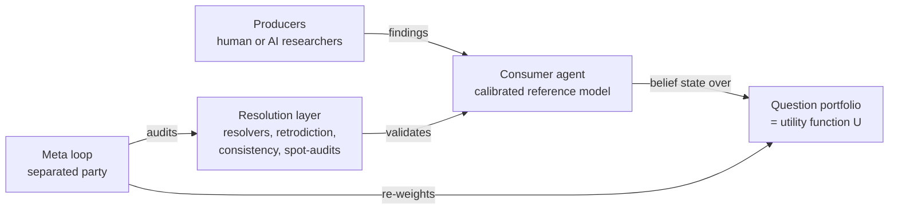

*How to manage research you cannot check: don't audit the process, meter the output's validated epistemic impact against a weighted question portfolio — mark the book the way a trading desk marks positions. Oversight capacity then scales with producer capability for whatever fraction of the portfolio nature resolves.*

:::note[Status]
Draft v0 · updated June 2026 · maintained by [QURI](https://quantifieduncertainty.org/). Agenda sketch, more speculative than the other proposals. Positions here are exploratory, not settled.
:::

## The problem

Frontier labs increasingly plan to delegate research — including safety research — to AI systems. This creates the sharpest instance of the oversight problem: how do you manage researchers whose object-level work you cannot check?

The default answers strain at scale. *Process auditing* (read the reasoning, review the methods) is more viable than naively assumed — [AI control](https://www.redwoodresearch.org/research/ai-control) protocols extract substantial safety from weaker trusted monitors, and rubric-based LLM judging already grades paper replications at scale ([PaperBench](https://openai.com/index/paperbench/)) — but its cost grows with output volume and its reliability degrades as the capability gap widens. *Trust the outputs* is not an oversight mechanism at all.

The alternative proposed here: **output-metered oversight**. Don't audit the research process; meter the research output's validated epistemic impact. The principal doesn't need to follow the work — they need to mark the book: track the program's beliefs the way a trading desk tracks its positions. Metering is complementary to control: control protects against subversion of the process; metering prices the product.

## The architecture

The system runs a research effort the way a market-maker runs a book:

1. **Question portfolio.** The research program's mission, represented as a few hundred importance-weighted questions. This is the utility function $U$, set and slowly revised by the human principals. A program's "key questions" document is raw material; operationalizing it into ~200 dispute-proof resolvable questions is weeks of specialist work, and the fidelity lost there is the first Goodhart step.
2. **Consumer agent.** A calibrated reference model whose belief state over the portfolio is "the book" — the program's current epistemic position. Its calibration and [consistency](/proposals/consistency-evals/) are themselves continuously evaluated; this is the component everything else leans on. Current models are not yet adequate here: LLMs incorporate new evidence unreliably (e.g. [belief entrenchment findings](https://arxiv.org/abs/2509.23936)), and frontier models have not yet demonstrated superhuman calibration on dynamic forecasting benchmarks — consumer-agent quality is a live constraint, not an assumption to wave through.
3. **Producers.** Research agents or teams submit findings. Credit equals validated marginal improvement in the portfolio score — the [Epistemic Impact Analysis](/proposals/epistemic-impact-analysis/) value $V(I, A, U)$, how much information $I$ moves agent $A$'s beliefs on portfolio $U$ — assigned sequentially, market-scoring-rule style, paid mostly at resolution. Incentive compatibility requires two-sided payoffs: bonded, escrowed credit, netted across each producer's identity-bound history, with fast-validator advances as recourse loans clawed back at resolution. Confirmation work, which moves beliefs little, is paid from the resolution budget instead.
4. **Resolution layer.** The falsehood-nullification enforcement — credit zeroed or clawed back when claims resolve false: question resolvers with pre-registered criteria, retrodiction against held-out facts, consistency checks, randomized expert spot-audits of resolution integrity. The integrity of the whole system equals the integrity of this layer.
5. **Meta loop, institutionally separated.** A distinct party periodically audits whether high-scoring research actually improved downstream decisions, and re-weights the portfolio — prospectively, with announced lead time; credit accrues against $U$ as frozen at submission. The producers must not mark their own book; if the same system optimizes against $V$ and amends $V$, the architecture is a reward-hacking machine with extra steps.

## Why this might scale where alternatives don't

The distinctive property: **for questions nature resolves, oversight capacity scales with producer capability, not overseer capability.** A principal who cannot follow a proof can still observe that the portfolio score improved and survived resolution. A fund principal doesn't audit each trader's reasoning; they mark positions to market and audit the marking. Strictly, though, this is mark-to-*model* until resolution: the marks are endogenous, movable by the producers being scored — the persuasion failure mode below, and the regime behind Enron's fair-value book and 2008's Level 3 assets — so the fund analogy holds in proportion to how much of the portfolio actually resolves. Elsewhere oversight concentrates on the resolution layer: still capability-limited, but targetable and auditable rather than small — resolving a claim can cost as much as producing it, so the scaling rests on sampling and amortization, and the resolvable fraction of the portfolio is a first-class design parameter.

This is the same shape as [resolution-grounded oversight protocols](/concepts/oversight-protocols/) generally, applied at the level of a research portfolio rather than a single claim. It also supplies what the debate lineage still lacks: cross-portfolio allocation. Debate aims to verify individual claims — with contested guarantees (obfuscated arguments; mixed gains in [Kenton et al. 2024](https://arxiv.org/abs/2407.04622)) and per-claim cost economics from [doubly-efficient debate](https://arxiv.org/abs/2311.14125) — but not which claims to verify, at what price, across a bounded budget and thousands of outputs.

The actor-critic intuition transfers: the system works exactly when the evaluator is harder to fool than the producers are clever — so investment should be permanently biased toward the resolution layer over the producers.

For safety research specifically, the resolvable region is limited: retrodiction on held-out model behaviors, capability predictions, and replications resolve; the central questions — does this technique prevent deceptive alignment? — resolve late, never, or catastrophically, and the [ELK report](https://www.alignmentforum.org/posts/qHCDysDnvhteW7kRd/arc-s-first-technical-report-eliciting-latent-knowledge) argues a producer modeling the resolution process itself (the human simulator) passes retrodiction and consistency checks while wrong off-distribution. There, this protocol complements judge-grounded methods rather than replacing them.

## Lineage and landscape

The idea has deeper roots than it might appear. [Hanson (1995)](https://www.tandfonline.com/doi/abs/10.1080/02691729508578768) proposed allocating scientific credit via betting markets on question outcomes, explicitly as an alternative to process-based peer review. The amplification pattern — forecasters predicting a trusted evaluator's judgment to stretch scarce evaluation — was proposed as [Prediction-Augmented Evaluation Systems](https://forum.effectivealtruism.org/posts/vgFnJhTiRco8DqBoC/prediction-augmented-evaluation-systems) (2018) and demonstrated in [Amplifying generalist research via forecasting](https://www.lesswrong.com/posts/cLtdcxu9E4noRSons/part-1-amplifying-generalist-research-via-forecasting-models) (2019), of which this proposal is a direct descendant with the human evaluator replaced by a calibrated reference model over a weighted portfolio. The credit mechanism — pay in proportion to scoring-rule performance, with the contract allocated by bidding — was proposed for human forecasters as [Accuracy Agreements](https://forum.effectivealtruism.org/posts/6aDPZJQDoQmZ2sooM/accuracy-agreements-a-flexible-alternative-to-prediction) (2023). And the feasibility evidence runs in both directions: forecasters predicting the value of small projects before execution discriminated good from bad but were [systematically optimistic](https://forum.effectivealtruism.org/posts/qb56nicbnj9asSemx/predicting-the-value-of-small-altruistic-projects-a-proof-of) (2020), and a [retrospective of 2018–19 LTFF grants](https://forum.effectivealtruism.org/posts/Ps8ecFPBzSrkLC6ip/2018-2019-long-term-future-fund-grantees-how-did-they-do) found research outputs often existed but were illegible or unpublished — *legibility*, not absence, was the validation bottleneck, and output-metering inherits that constraint. And prediction-based scoring of research claims has empirical support: replication markets achieved roughly 73% accuracy on ~100 resolved claims across earlier projects ([Gordon et al. 2021](https://journals.plos.org/plosone/article?id=10.1371/journal.pone.0248780)), with cheap surveys statistically indistinguishable; DARPA SCORE then scaled the forecasting side to ~3,000 priced claims ([Gordon et al. 2020](https://royalsocietypublishing.org/doi/10.1098/rsos.200566)) but could not afford to resolve them. That gap strengthens this page's central claim from the other direction. The resolution layer is the system.

What exists today instead of output-metering: capability benchmarks for research agents ([RE-Bench](https://arxiv.org/abs/2411.15114), [MLE-bench](https://arxiv.org/abs/2410.07095), [PaperBench](https://openai.com/index/paperbench/)) score against fixed task metrics or rubrics, and lab oversight agendas ([superalignment](https://openai.com/index/introducing-superalignment/), [amplified oversight](https://arxiv.org/abs/2504.01849), [AISI safety cases](https://www.aisi.gov.uk/blog/safety-cases-at-aisi)) are either process audits or per-claim judge-grounded evaluations; none meter producers against a weighted question portfolio. The junction — belief-grounded, portfolio-weighted scoring of research *producers* — appears unoccupied.

## Failure modes

Stated plainly, because each one is a research problem:

- **Persuasion of the consumer.** If credit flows on belief movement alone, the gradient favors rhetoric — and as drawn, the update step is the *consultancy* protocol, which degrades judge accuracy under persuasive advocacy ([Michael et al. 2023](https://arxiv.org/abs/2311.08702), [Khan et al. 2024](https://arxiv.org/abs/2402.06782)). Mitigations: pay at resolution (binding only for the portfolio weight that resolves on a useful horizon; beyond it everything rests on the consistency-hardened consumer); make the update adversarial — counter-producers paid for moving the book the other way, or debate-style comparison before the consumer updates.
- **Portfolio fixation.** A fixed question set cannot value paradigm shifts — research showing the portfolio asks the wrong questions. Meta-questions help but resolve by panel judgment, keeping this the most human-dependent component for the longest.
- **Resolver corruption and collusion.** Producers and resolvers (or producer agents sharing a base model with the consumer) may correlate or collude. Mitigations: diverse resolver ensembles, randomized audits, adversarial red-team producers rewarded for exposing resolution failures. Producers may also lobby the meta loop's re-weighting instead.
- **Strategic churn and Sybils.** If losses floor at zero, one identity injects an error and a colluder — or the same producer re-keyed — collects on the correction; withholding and bundling game sequential credit. Hence the two-sided, identity-bound escrow above.
- **Resolution ambiguity.** Disputed and N/A resolutions are the modal resolution-layer failure on real platforms; adversarial producers exploit criteria gaps first. Mitigations: pre-registered criteria, versioned adjudication, ambiguity rate as a portfolio health metric.
- **Goodharting the portfolio.** Optimizing measurable questions at the expense of unmeasured mission value — the classic evaluation side-effect. The meta loop exists precisely to detect score/value divergence, which is why its independence is non-negotiable.

## A pilot

The proposal is testable now, reflexively, at small scale:

1. Define a portfolio of roughly 200 weighted questions for one research domain the team actually works in.
2. Stand up a consumer agent; benchmark its calibration and consistency.
3. Retroactively score several months of the program's real outputs — restricted to post-cutoff material the consumer cannot already state — measuring validated portfolio-score improvement for each paper or post.
4. Compare metered scores against the researchers' own retrospective judgments of which outputs mattered.

The divergences are the deliverable. Where the meter and the judgment disagree, either the portfolio is mis-weighted (meta-loop data), the consumer is miscalibrated (eval data), or the intuition is wrong (the interesting case). Failure conditions should be pre-registered: if metered scores are predicted as well by length and venue as by content, or are unstable under question rewording, the meter is measuring prestige and phrasing, not epistemic impact.

## Open questions

- What incentive guarantees can be proven, and under which assumptions about consumer calibration and resolver integrity?
- How should partial credit be split between *surprise now* and *validation later* to keep both incentives and cash-flow workable for long-horizon research?
- Can portfolio representations value exploratory work whose impact routes through later, not-yet-asked questions?
- What is the minimal institutional separation for the meta loop that survives real organizational pressure?
- How does this compose with judge-grounded protocols for the genuinely unresolvable parts of a research mission?
