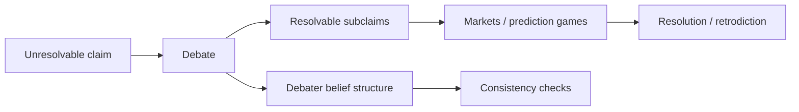

*Scalable-oversight protocols are best organized by what their incentives ground out in: a judge's verdict, external resolution, internal coherence, or peer agreement. No grounding dominates — they cover different claim classes and fail differently — which is why the natural design is a composition, and why the field still lacks an economics of which claims to verify at what price.*

:::note[Status]
Draft v0 · updated June 2026 · maintained by [QURI](https://quantifieduncertainty.org/). Positions here are exploratory, not settled.
:::

## The problem

Scalable oversight ([DeepMind's term](https://arxiv.org/abs/2504.01849): *amplified oversight*) asks: how does a weaker principal extract honest, high-quality information from a more capable agent — essentially the [ELK problem](https://www.alignmentforum.org/posts/qHCDysDnvhteW7kRd/arc-s-first-technical-report-eliciting-latent-knowledge) restated? The incentive-based proposals — debate, market-making, prover-verifier games, recursive reward modeling — share a structure: each is a mechanism for making honesty the agent's best strategy. Non-incentive approaches — [AI control](https://arxiv.org/abs/2312.06942), interpretability, weak-to-strong generalization — sit outside this taxonomy by design.

The claim of this page: these protocols are best organized by **what their incentive grounds out in**. Every protocol needs some final arbiter that the reward chain terminates in, and there are only a few candidates:

| Grounding | Protocols | The agent profits by... | Characteristic failure |
|---|---|---|---|
| A judge's verdict | [Debate](https://arxiv.org/abs/1805.00899), consultancy, [prover-verifier games](https://arxiv.org/abs/2407.13692), [recursive reward modeling](https://arxiv.org/abs/1811.07871), [market-making](https://www.alignmentforum.org/posts/YWwzccGbcHMJMpT45/ai-safety-via-market-making) | convincing the judge | persuasion ≠ truth; obfuscation |
| External resolution | Prediction markets, retrodiction games, producer/consumer prediction games | beating the market and being right later | only covers resolvable claims; latency; resolution ambiguity/manipulation |
| Internal coherence | [Consistency evaluations](/proposals/consistency-evals/), Dutch-book tests | being unexploitable | consistent-but-wrong; evasive vagueness |
| Peer agreement | [Peer prediction](https://en.wikipedia.org/wiki/Peer_prediction), [Bayesian Truth Serum](https://en.wikipedia.org/wiki/Bayesian_truth_serum) | reporting what informed peers would report | collusion; herding on plausible falsehoods |

No grounding dominates. They cover different claim classes, fail differently, and cost differently — which is exactly why they compose. (A possible fifth grounding — a principal's *own future decisions* — was sketched in [decision forecasting](https://www.lesswrong.com/posts/DCkHSrD53Methoxu6/what-if-people-simply-forecasted-your-future-choices) (2018); we leave it aside here.)

## Judge-grounded: debate and its discontents

In [safety via debate](https://arxiv.org/abs/1805.00899), two agents argue opposing sides and a weaker judge picks the winner; the hope is that the equilibrium strategy is honesty, because lies have refutable structure. The line has real theory ([doubly-efficient debate](https://arxiv.org/abs/2311.14125) gives complexity-theoretic guarantees) and real experiments — with human debaters and judges ([Michael et al. 2023](https://arxiv.org/abs/2311.08702)), with weak LLM judges overseeing strong LLM debaters ([Kenton et al. 2024](https://arxiv.org/abs/2407.04622)), and with the finding that selecting debaters for inference-time persuasiveness *increased* judge accuracy ([Khan et al. 2024](https://arxiv.org/abs/2402.06782)) — though Kenton et al. found such gains largely confined to information-asymmetric QA, not replicating across tasks.

The predict-the-judge structure predates LLMs: [Prediction-Augmented Evaluation Systems](https://forum.effectivealtruism.org/posts/vgFnJhTiRco8DqBoC/prediction-augmented-evaluation-systems) (2018) proposed amplifying expensive evaluations with forecasters, and a 2019 experiment found crowd predictions of a trusted evaluator captured roughly 72% of the benefit-cost value of direct evaluation ([Amplifying generalist research via forecasting](https://forum.effectivealtruism.org/posts/ZTXKHayPexA6uSZqE/part-2-amplifying-generalist-research-via-forecasting)).

Its pathologies all stem from the grounding. The training signal is *what convinces the judge*, so truth wins only where the argument landscape favors it. LLM judges add an instability of their own: prompt phrasing alone can shift their judgments by double digits, and ranges across models and personas are far larger ([opinion fuzzing](https://quantifieduncertainty.org/posts/opinion-fuzzing-a-proposal-for-reducing-exploring-variance-in-llm-judgments-via-sampling/) measures and partially tames this). The [obfuscated arguments problem](https://www.alignmentforum.org/posts/PJLABqQ962hZEqhdB/debate-update-obfuscated-arguments-problem) is the sharpest version: a dishonest debater can construct arguments whose flaws are too expensive to locate, and the judge cannot tell obfuscation from depth — a problem that symmetrically denies honest debaters their large implicit argument trees. A protocol-level fix has been proposed — [prover-estimator debate](https://arxiv.org/abs/2506.13609) — but is so far theoretical, and its honesty guarantee requires a stability assumption on the problem.

In economic terms: an obfuscated argument is like a mispriced security whose audit cost exceeds the arbitrage profit — nobody is paid enough to find the flaw. But the supply is endogenous — a debater manufactures obfuscated claims more cheaply than anyone can audit them — so verification subsidies alone are drainable; the load-bearing instrument is an assertion fee (stake-to-assert), with subsidies and decomposition bounties secondary. The game-theoretic framing generates none of this.

Debate's distinctive virtue: for claims that *never resolve*, it is the only grounding that delivers a verdict on the specific claim at hand — peer prediction offers only a statistical incentive, consistency only a partial filter.

## Resolution-grounded: markets and prediction games

The alternative is to ground incentives in external resolution.

### The producer/consumer prediction game

Our construction (not established literature), named so it can be referenced:

:::tip[Definition — producer/consumer prediction game]
An **information producer** trades against a calibrated **information consumer** — a reference LLM holding the current belief state ("the market," "the prior"). The producer profits by finding questions where the consumer is wrong, moving its beliefs, and being validated when the question resolves.
:::

The consumer must be a committed, subsidized market maker scored by a proper scoring rule ([Hanson's LMSR](https://mason.gmu.edu/~rhanson/mktscore.pdf)): it knowingly loses money to buy information — the subsidy is the price of elicitation — which also dissolves the Milgrom–Stokey no-trade objection (a rational counterparty would update on the offer itself; a committed market maker cannot).

[Hubinger's market-making proposal](https://www.alignmentforum.org/posts/YWwzccGbcHMJMpT45/ai-safety-via-market-making) is the closest relative, but it grounds out in the human judge's stable equilibrium belief, not in any external event — hence the judge row above, market machinery notwithstanding. The producer/consumer game's explicit novel move is replacing that human-equilibrium resolution with genuine external resolution. Empirical work is only beginning: a [proof-of-concept demo](https://blog.bluedot.org/p/demonstration-of-ai-safety-via-market-making) (2024) and an inference-time multi-agent version reporting accuracy gains over single-agent baselines ([Gho et al. 2025](https://arxiv.org/abs/2511.17621)) — neither pays at resolution, and *training* models to a market's stable equilibrium remains untested.

Persuading the consumer is necessary but not sufficient — false persuasion is priced at the resolution horizon, wherever resolution is trusted and actually reached. This removes judge-grounding's core failure — a training signal that rewards persuasiveness rather than truth — as the *terminal* incentive, though whoever interprets the resolution criteria becomes a smaller persuasion target. The incentive failures here are documented, not hypothetical: real platforms' scoring rules and tournament structures reward probability distortion and information hoarding ([Alignment Problems with Current Forecasting Platforms](https://arxiv.org/abs/2106.11248)), and corporate-internal prediction markets have repeatedly failed on tooling, question-writing cost, and social disruption ([Prediction Markets in the Corporate Setting](https://forum.effectivealtruism.org/posts/dQhjwHA7LhfE8YpYF/prediction-markets-in-the-corporate-setting)). The price is coverage: the protocol only directly handles resolvable claims, and resolution is slow. Resolution can also be *deferred*: fix a protocol now for selecting the most-trusted resolver at resolution time — [Epistemic Selection Protocols](https://quantifieduncertainty.org/posts/ai-for-resolving-forecasting-questions-an-early-exploration/) — a question first posed as [whether post-AGI evaluators can be trusted](https://www.lesswrong.com/posts/HB6aGCPjtvpLk4K9t/can-we-place-trust-in-post-agi-forecasting-evaluations) (2019).

Both costs can be pushed back:

- **Retrodiction** can expand the resolvable set — hide known facts (redacted study results, post-cutoff events, masked dataset entries) and resolve immediately against them — if contamination can be controlled; held-out banks decay with each model release, and authoring genuinely hidden questions is itself costly.
- **Fast partial validators** — [consistency checks](/proposals/consistency-evals/), spot-audits — let the system advance credit against slow resolution. The advance is a gameable proxy, so it wants escrow, clawbacks at resolution, and randomized audit timing.

Question provenance needs the same care — a known cost center on human forecasting platforms. A producer that picks its own questions can arbitrage ambiguity, or under retrodiction concentrate bets on items it has memorized. Hence: separate proposer from trader, overseer-selected retrodiction targets, resolution criteria fixed before trading, no profit on questions later ruled ambiguous.

## Coherence-grounded: consistency

Consistency protocols need no judge and no resolution: the agent is scored on whether its own outputs can be arbitraged — Dutch-booked, as when its probabilities on a claim and its negation sum past 1. Cheap, unsupervised, scalable, and strictly partial — a useful screen, neither necessary (honest bounded reasoners are incoherent somewhere) nor sufficient (coherent deceivers exist). See [Consistency Evaluations](/proposals/consistency-evals/) for the full treatment.

## Agreement-grounded: peer prediction

Peer prediction scores a report by how well it predicts other informed agents' reports, making truth-telling an equilibrium with no judge and no resolution — built precisely for claims with no ground truth ([Miller, Resnick & Zeckhauser 2005](https://doi.org/10.1287/mnsc.1050.0379); [Prelec 2004](https://doi.org/10.1126/science.1102081)). It is the least trusted grounding here: the guarantees assume non-colluding reporters, and LLM copies are the easiest colluders imaginable.

## Composition: the hybrid protocol

Since the groundings cover complementary territory, the natural design is layered:

Debate operates over the unresolvable claim, but its subclaims are anchored by markets wherever they touch resolvable ground, and the debaters' probability assignments are continuously consistency-checked. The judge's job shrinks from "evaluate everything" to "evaluate the genuinely unresolvable residue" — which is the only part a judge was ever the right tool for. Each edge buys something specific — markets cap the payoff on false resolvable subclaims; consistency checks catch incoherent belief structure — but the cover is partial: a consistent, obfuscated, unresolvable argument slips all three.

## The missing economics

A final observation. Debate gave oversight a *game theory*: how to verify a claim, given unbounded debaters and a bounded judge. It says nothing about which claims are worth verifying, what verification should cost, or how to allocate bounded oversight across thousands of claims. That allocation layer — value of information, subsidies, question weights, portfolio effects — is an economics. [AI control](https://arxiv.org/abs/2312.06942) has the nearest existing piece — explicit audit budgets and defer-to-trusted thresholds — but for catching bad actions, not pricing truth-seeking. [Epistemic Impact Analysis](/proposals/epistemic-impact-analysis/) is our attempt to extend allocation from audit budgets to epistemic value across claims, and [Overseeing Automated Research](/proposals/overseeing-automated-research/) is the application where the economics becomes the whole point.

## Open questions

- Head-to-head empirics: on the same task set with the same weak overseer, how do resolution-grounded protocols compare to debate? Standardized comparison infrastructure is emerging ([a benchmark for oversight protocols](https://arxiv.org/abs/2504.03731); [scaling laws for oversight across capability gaps](https://arxiv.org/abs/2504.18530)), but no published comparison yet includes payment-at-resolution incentives or deceptive-producer conditions.
- How far can retrodiction extend resolution-grounding before models' background knowledge contaminates the held-out facts?
- Do peer-prediction mechanisms survive contact with colluding LLM agents? [Qiu et al. 2026](https://arxiv.org/abs/2601.20299) post-train LLMs via peer prediction and find resistance to deception grows with the capability gap, but collusion remains open.
- What does equilibrium look like in the hybrid protocol — does anchoring subclaims actually change debate's training dynamics, or just its evaluation?
- Who controls decomposition in the hybrid? A dishonest debater could route convenient subclaims onto resolvable ground while the load-bearing claim stays in the unresolvable residue.
