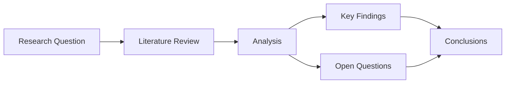

import Counter from '@/components/Counter';

This page demonstrates the features included in this starter template.

## React Component

Interactive components work out of the box. This counter is a React component imported from `src/components/Counter.tsx`:

<Counter label="Clicks" client:load />

## Mermaid Diagram

## Math Rendering

Inline math: $E = mc^2$

Display math:

$$
\text{Expected Value} = \sum_{i=1}^{n} P(x_i) \cdot V(x_i)
$$

## Table

| Feature | Included | Notes |
|---------|----------|-------|
| Mermaid diagrams | Yes | Flowcharts, sequence diagrams, etc. |
| Math (KaTeX) | Yes | Inline and display equations |
| React components | Yes | For interactive elements |
| Tailwind CSS | Yes | Utility-first styling |
| Auto sidebar | Yes | Based on directory structure |
| Search | Yes | Built into Starlight |

## Cross-Reference

See the [Getting Started](/example/getting-started/) page for setup instructions.
